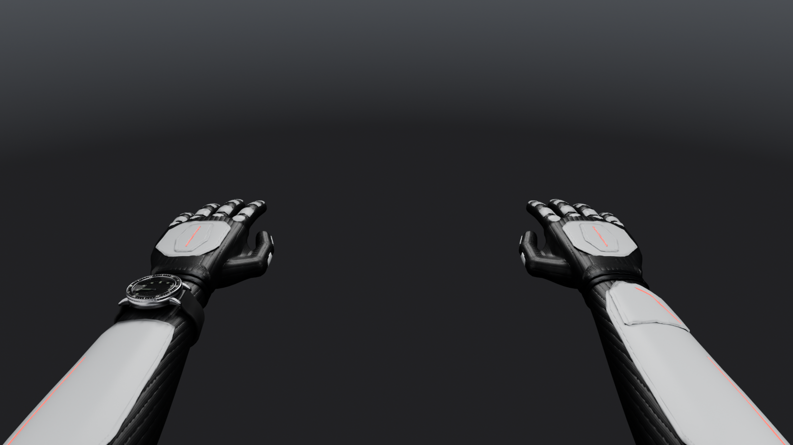
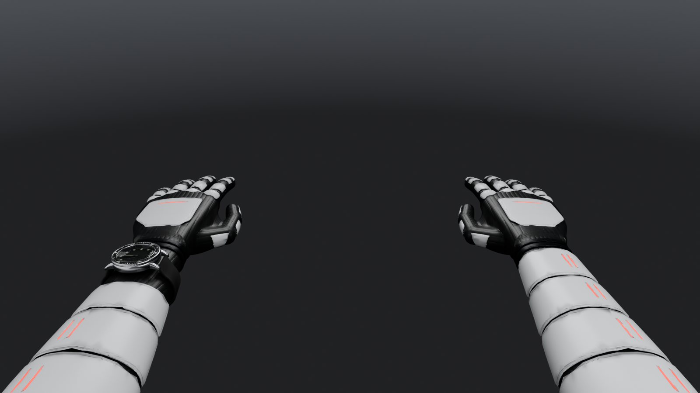
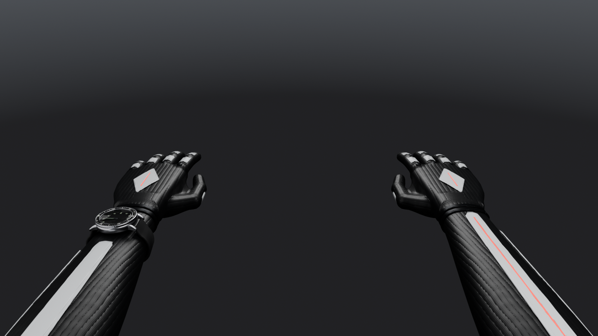
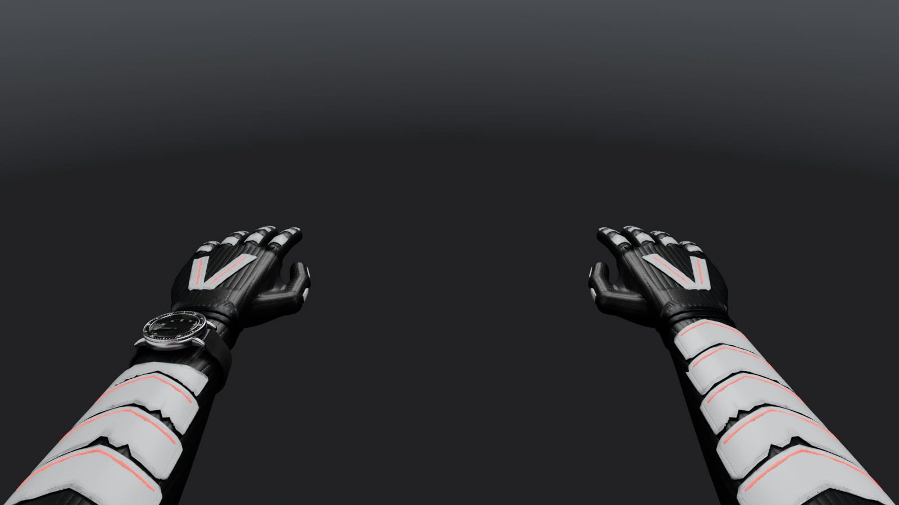
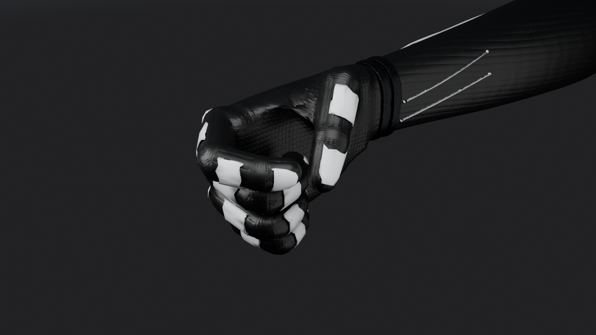
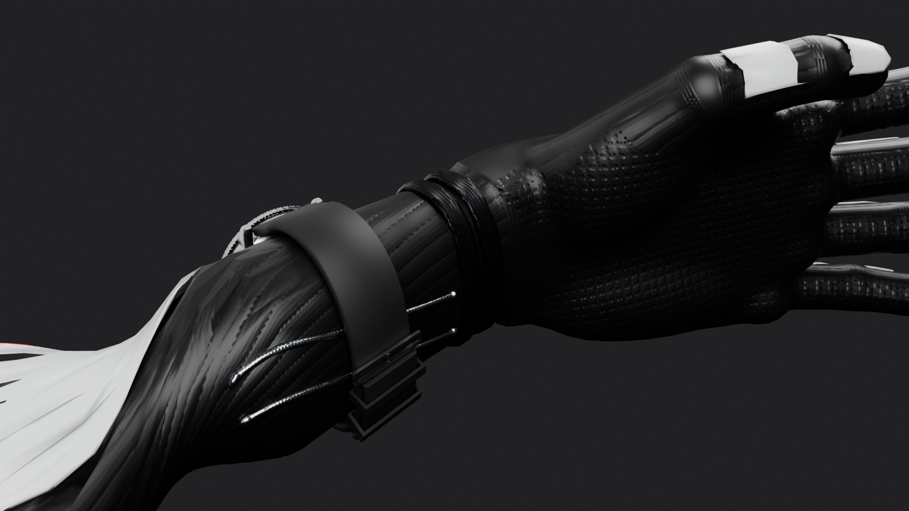

# First-person arms

`public/viewmodels/v2/arms.glb` is the one arms rig every weapon and knife uses. The arms are a
slim cyborg: dark corded synthetic muscle with thin hard plates on the backs of the hands, the
fingers and the forearms, a machined band and two cables at each wrist, and glow lines set into
grooves in the plates. A dive watch sits on the bare left wrist.

The file carries one plate kit per armor set (Strafe, Anvil, Vector, Quill), all on the same rig.
The player's arms piece picks the kit, the plates take the primary paint and finish (edge wear
included), the muscle leans towards the secondary paint and the glow lines light up in the accent
colour (`src/characters/fpArmor.ts`).

| kit | shape language |
|---|---|
| Strafe | one long forearm shell with a layered plate over its wrist end, a hexagonal hand plate, oval knuckle caps, rounded finger plates |
| Anvil | four wraparound forearm bands with glowing vents, a wide hand plate and a knuckle bar, square finger and thumb plates |
| Vector | a narrow spine and a side splint on the forearm, a small diamond hand plate, plates on the first two finger bones only |
| Quill | five chevron blades down the forearm with glowing leading edges, two feather blades on the hand, pointed finger plates |

It is original: every mesh and texture is generated by the scripts in `tools/blender/arms/`. No
imported models, scans, photos or downloaded textures.

| | |
|---|---|
|  |  |
|  |  |
|  |  |

## Rebuild

```bash
blender -b --factory-startup --python-exit-code 1 -P tools/blender/arms/build_arms.py -- \
  --out .blender-tmp/arms/arms_raw.glb --renders docs/screenshots/arms
npx tsx tools/assets/optimize-glb.ts .blender-tmp/arms/arms_raw.glb public/viewmodels/v2/arms.glb --texture-size 1024
npx tsx tools/assets/ktx2-textures.ts public/viewmodels/v2/arms.glb public/viewmodels/v2/arms.glb
npx vitest run tools/assets/arms.test.ts tools/assets/budgets.test.ts src/characters/__tests__/fpArmor.test.ts
```

About 15 minutes on an M5 MacBook, most of it meshing the 70 plate pieces. Meshed pieces are
cached in `.blender-tmp/arms/mesh-cache`, keyed by sampling each piece's field, so a rebuild only
re-meshes what changed. For iterating:
`--kits strafe` builds one kit, `--pieces strafe_hand,strafe_index` only those pieces,
`--no-textures` skips the atlas, `--no-export` stops after the renders, `--only-renders fp,top`
picks shots (`rest`, `top`, `fp`, `fist`, `palm`, `watch_closeup`, `elbow_bend`).

## How it is built

- `params.py`: every number: joints (unchanged from the old gloved rig, so the knife grips still
  fit), the lean muscle cross sections, wrist band and watch zone.
- `suit.py`: ha8,5nd forearm muscle as one signed distance field: a thin palm slab, pads,
  knuckle heads, round-cone fingers and thumb, and a superellipse forearm with muscle bundles
  (`arm.muscle_offset`) on the thumb and palm side. Meshed with OpenVDB at 0.75 mm voxels,
  decimated to 11,000 triangles per arm and projected back onto the exact surface.
- `arm.py`: the lofted upper arm, starting under a small raised lip that hides where the field
  ends.
- `kits.py`: every plate, mechanical part and glow line as its own small field. Plates are shells
  over the muscle cut by an outline drawn in the surface's own coordinates (around and along the
  forearm, across the back of the hand, along and across each finger bone), with chamfered edges
  and grooves for the glow lines. Forearm plates that reach into the watch zone get a left arm
  twin cut back past the strap.
- `texture.py`: one 2048 atlas (shipped at 1024 as KTX2), generated per texel: corded fibres along the limbs, flex ribs over
  the wrist and finger joints, grip pads on the palm and finger pads, engraved panel lines inset
  from plate edges, the edge mask the shader chips paint on, ribbed bands and wound cables. Normals
  come from each piece's own field, so chamfers stay crisp on the decimated meshes. AO is baked
  for the core alone and for each kit over the core, never one kit against another.
- `rig.py`: armature and custom skin weights. Muscle weights blend at every joint; hand and digit
  plates are rigid on their bone; forearm plates follow the muscle under them so wrist roll never
  pushes it through.
- `watch.py`, `meshutil.py`: the watch. `materials.py`, `render.py`: preview materials and renders.

Everything is joined into one skinned mesh `arms` with one primitive per material
`fp_<set>_<slot>` (set `core` or a kit id, slot one of `muscle`, `primary`, `dark`, `metal`,
`glow`), so the file keeps a single skin. Each of those materials carries the atlas as its normal
and occlusion texture (ORM: R ambient occlusion, G roughness detail around 0.5, B edge wear).

## Dimensions

| part | size |
|---|---|
| hand, wrist crease to middle fingertip | 19.5 cm (joints as before) |
| palm width at the knuckles, thickness | 8.4, 2.8 cm |
| finger radius | about 0.92 cm at the base to 0.73 cm at the tip (pinky 0.80 to 0.64) |
| forearm | 26 cm; width x depth 5.0 x 3.2 at the wrist, 7.0 x 5.4 mid, 8.0 x 7.0 near the elbow |
| plates | 0.9 to 2 mm thick, 0.2 to 0.6 mm over the muscle |
| glow lines | 1.1 mm tubes in 1.6 mm grooves |

## Rig

Unchanged: armature `ArmsRig`, 38 deform bones with suffix `_l` / `_r`, same joint positions,
axes and runtime conventions as before (two-bone IK on `upperarm` and `forearm`, roll on
`forearm_twist`, digits curl about local -X, hide an arm by scaling its `upperarm` to zero). The
watch is an object tree under `forearm_twist_l` with spinning hands, see
`tools/blender/README.md`.
