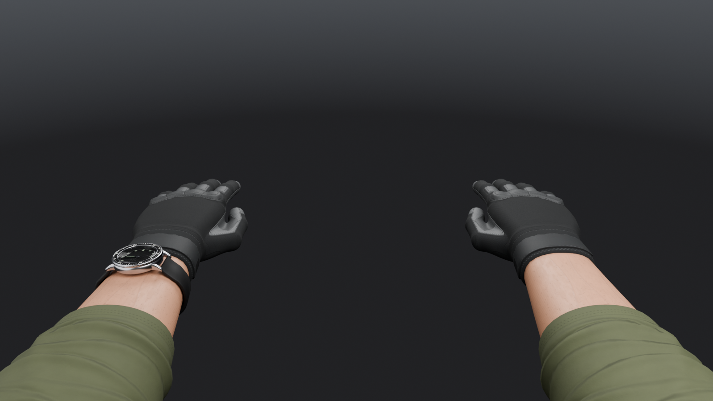
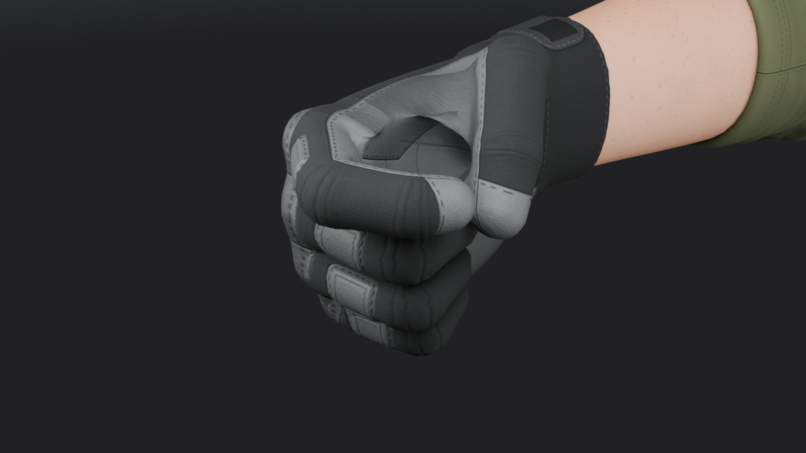
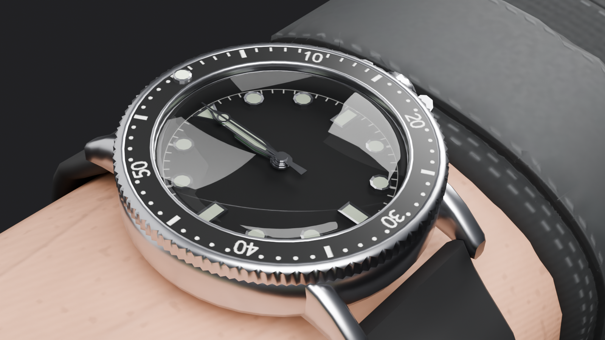
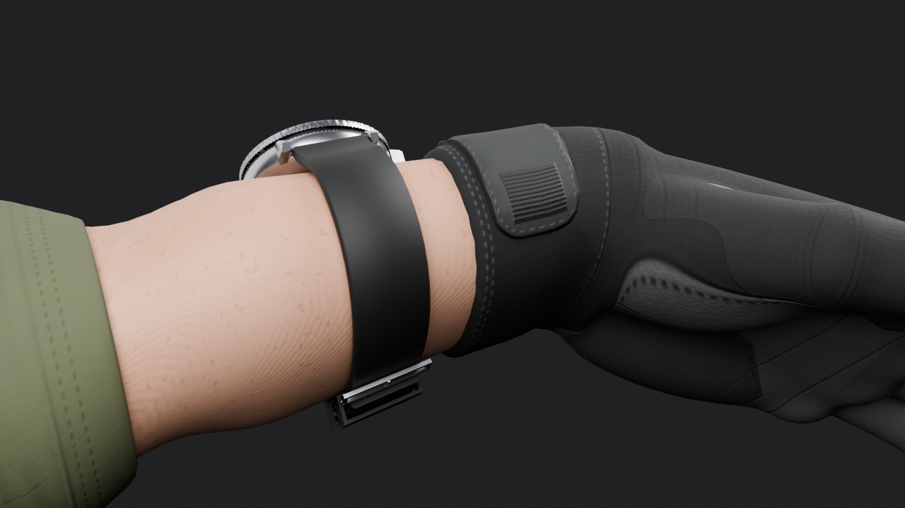

# First-person arms

`public/viewmodels/v2/arms.glb` is the one arms rig every weapon and knife uses, so the hands
always match. Both arms wear dark charcoal tactical gloves with grey palm and knuckle pads, olive
soft-shell sleeves are pushed up to mid forearm, a band of bare forearm shows between sleeve and
cuff, and a dive watch sits on the left wrist.

It is original: every mesh and texture is generated by the scripts in `tools/blender/arms/`. No
imported models, scans, photos or downloaded textures. The build is headless and deterministic
(back to back builds write byte-identical GLBs).

| | |
|---|---|
|  |  |
|  |  |

`elbow_bend.png` shows the right elbow at 90 degrees with the grip applied.

## Rebuild

```bash
blender -b --factory-startup --python-exit-code 1 -P tools/blender/arms/build_arms.py -- \
  --out .blender-tmp/arms/arms_raw.glb --renders docs/screenshots/arms
npx tsx tools/assets/optimize-glb.ts .blender-tmp/arms/arms_raw.glb public/viewmodels/v2/arms.glb --texture-size 1024
npx vitest run tools/assets/arms.test.ts
```

About 1 min 45 s for the asset on an M5 MacBook (Cycles on Metal, the AO bake on the CPU) plus
about a minute for the five renders. `--fast` does a coarse pass, `--save-blend x.blend` keeps
the scene, `--no-textures` skips the atlas.

## How it is built

- `params.py`: every anatomical number (joints, proportions, cross sections, cuff, hem, watch).
- `sdf.py`, `hand.py`: the glove as a signed distance field built from smooth-unioned
  primitives: palm slab, thenar and hypothenar pads, round-cone finger segments with knuckle and
  joint bulges, an opposable thumb, the cuff and its velcro strap, raised knuckle guard and
  finger pads. Meshed with OpenVDB at 0.8 mm voxels, decimated to 10,600 triangles per hand,
  then every vertex is projected back onto the exact surface and relaxed along it.
- `arm.py`: forearm skin and the pushed-up sleeve as lofted tubes over measured cross sections,
  with a rolled hem, bunched folds and a closed shoulder cap.
- `texture.py`: one 2048 atlas for glove, skin and sleeve (base colour, ORM, tangent space
  normal), generated per texel from baked position and normal maps: knit glove fabric, pebbled
  grey pads, stitched seams, the ridged velcro tab, skin pores, veins, freckles and a faint arm
  hair haze, soft-shell weave, hem stitching and fold crinkles, plus baked AO. Shipped at 1024
  WebP. The build fails if two triangles ever share a texel.
- `rig.py`: armature and custom skin weights (no heat weighting).
- `watch.py`, `meshutil.py`: the watch. `materials.py`, `render.py`: materials and previews.
- The left arm is an exact mirror of the right (same UVs). All six arm pieces are joined into one
  skinned mesh `arms` with a primitive per material, so the file keeps a single skin.

## Dimensions (gloved adult male)

| part | size |
|---|---|
| hand, wrist crease to middle fingertip | 19.5 cm |
| palm length, width at the knuckles, thickness | 10.5, 9.2, 3.3 cm |
| fingers from the knuckle: index, middle, ring, pinky | 7.4, 8.2, 7.7, 6.2 cm (segments 0.46 / 0.30 / 0.24) |
| finger radius | about 1.05 cm at the base to 0.85 cm at the tip (pinky 0.93 to 0.75) |
| thumb metacarpal, proximal, distal | 4.6, 3.3, 2.8 cm, radius 1.15 cm, about 37 degrees from the index |
| forearm | 26 cm; width x depth 6.0 x 4.0 wrist, 8.4 x 6.6 mid, 9.6 x 8.4 near the elbow |
| upper arm | 30 cm to the shoulder |
| glove cuff, sleeve hem | cuff reaches 4 cm up the forearm, hem at 13 cm, so about 9 cm of skin shows |
| watch | 41 mm steel case, 12.5 mm thick, 48 mm lug to lug, 20 mm strap, about 6.4 cm above the wrist, 1.5 mm over the skin |

The watch has lugs, a crown with crown guards at 3, a 120-click bezel with a raised grip edge and
a printed insert, a matte black dial with applied indices, separate hour, minute and second hands,
a domed crystal, a case back, and a rubber strap that follows the wrist's real cross section with
a steel buckle on the palm side and two keepers.

## Rig

Armature `ArmsRig`, 38 deform bones with suffix `_l` / `_r`. No constraints, no animations.

| bone | parent | head | tail |
|---|---|---|---|
| `upperarm` | `ArmsRig` | shoulder | elbow (30 cm) |
| `forearm` | `upperarm` | elbow | wrist (26 cm) |
| `forearm_twist` | `forearm` (not connected) | 7 cm before the wrist | wrist |
| `hand` | `forearm_twist` | wrist | middle knuckle (10.5 cm) |
| `thumb_01..03` | `hand`, then chained | thumb base | tip |
| `index_01..03`, `middle_*`, `ring_*`, `pinky_*` | `hand`, then chained | knuckle | tip |

Rest pose joint positions measured from the shipped GLB, three.js metres (Y up, camera at the
origin looking down -Z):

| joint (node) | right | left |
|---|---|---|
| shoulder (`upperarm`) | (0.190, -0.280, 0.120) | (-0.190, -0.280, 0.120) |
| elbow (`forearm`) | (0.190, -0.280, -0.180) | (-0.190, -0.280, -0.180) |
| twist (`forearm_twist`) | (0.190, -0.280, -0.370) | (-0.190, -0.280, -0.370) |
| wrist (`hand`) | (0.190, -0.280, -0.440) | (-0.190, -0.280, -0.440) |
| middle knuckle (`middle_01`) | (0.190, -0.280, -0.545) | (-0.190, -0.280, -0.545) |
| dial centre (`watch`) | | (-0.190, -0.248, -0.377) |

Skin weights: at most 4 influences, normalized. `upperarm` to `forearm` blends from 4.5 cm above
the elbow to 5 cm below it. `forearm` to `forearm_twist` ramps from 15.5 to 8.8 cm above the
wrist, so everything under the watch and cuff is rigid on the twist bone and the strap never cuts
in. `forearm_twist` to `hand` blends from 2.2 cm above the wrist to 2 cm past it. The glove is
first split softly into palm, thenar, each finger and the thumb from the SDF part distances, then
blended along each chain at every joint.

## Driving it at runtime

- Bone axes survive the export: local +Y runs along the bone towards the child, local +X is world
  +X at rest on both sides, local +Z is up (back of the hand) on the arm, hand and finger bones.
- Two-bone IK: `upperarm` (0.30 m) and `forearm` (0.26 m), target the `hand` joint. The rest pose
  is dead straight, so the solver needs a pole (elbows down and a little out). Keep
  `forearm_twist` out of the IK, it is collinear with the forearm.
- Forearm roll: rotate `forearm_twist` about local Y (verified at 60 degrees). Wrist: flex `hand`
  about local -X (positive bends towards the palm), deviation about local Z.
- Fingers and thumb: curl every digit bone about local -X, positive closes towards the palm, on
  both sides. The thumb bones have local Z out of the thumbnail; swinging the thumb across the
  fingers is mostly a local Z rotation.
- Left side: a local rotation that works on the right mirrors to the left by keeping the axis X
  component and negating Y and Z (same angle). So curls are identical, twist and deviation flip.
- Preview grip in `fist_pose.png`, as local rotations on the right hand: `hand` 8 degrees,
  index 42 / 58 / 26, middle 78 / 92 / 42, ring 80 / 94 / 44, pinky 84 / 92 / 42 (all about -X),
  thumb 22.5 about (0.387, 0, 0.922), 38.6 about (-0.439, 0, 0.898), 9.5 about (0.807, 0, 0.590).
  The fingers close around a channel that runs along the knuckle line through about 9.3 cm along
  local +Y and 2.0 cm along local -Z from the wrist joint (hand bone frame), 2 to 2.7 cm across,
  so open the curls for a thick grip.
- Hide an arm by scaling its `upperarm` bone to zero.
- Watch: `watch` and its children are objects, which the exporter converts to Y up. In three.js
  the dial normal is local +Y, 12 o'clock is local -Z and the crown (3 o'clock) is local +X. Spin
  `watch_hand_hour`, `watch_hand_minute`, `watch_hand_second` and `watch_bezel` about local Y;
  clockwise on the dial is negative, for example `hand.rotation.y = -2 * Math.PI * fraction`.
  They are identity pivots on the dial centre. `watch_dial` UVs cover the full 0..1 square and
  `watch_bezel` UVs run u = angle clockwise from 12, v = radius, for canvas textures.

## Materials

| material | on | notes |
|---|---|---|
| `mat_glove`, `mat_skin`, `mat_sleeve` | the three `arms` primitives | share the atlas (base colour, ORM, normal) |
| `mat_watch_steel` | case, lugs, crown, bezel edge, index frames, hands, buckle | metallic, roughness 0.26 |
| `mat_watch_bezel` | bezel insert | black, printed 60 minute scale texture |
| `mat_watch_dial` | dial | matte black, printed minute track texture |
| `mat_watch_lume` | index and hand fills, bezel pip | pale green, faint emission |
| `mat_watch_crystal` | domed crystal | glass, alpha 0.28, alpha blend |
| `mat_watch_strap` | strap and keepers | black rubber, roughness 0.62 |

## Budget

| part | triangles |
|---|---|
| glove | 10,600 per hand |
| forearm skin | 1,856 per arm |
| sleeve | 3,800 per arm |
| arms total | 32,512 |
| watch | 5,843 (case 1,416, bezel 1,798, crystal 480, dial 48, indices 451, crown 396, strap 1,012, hands 67 / 67 / 108) |
| total | 38,355 of 40,000 |

File: 832 KB (852,440 bytes) after meshopt and WebP, from a 10.6 MB raw export. Textures inside:
arms normal 100 KB, ORM 80 KB, base colour 32 KB (1024 px), dial 8 KB, bezel 6 KB.

## Known issues

- Plain linear blend skinning, no corrective shapes. In a full fist about 20 triangles on the
  palm side of the finger joints fold into the crease; they stay hidden inside the grip.
- Verified poses are the ones rendered: fist with the thumb wrapped, wrist flexed 30 degrees with
  a 60 degree twist, elbow at 90 degrees. Expect some volume loss well past those.
- No LODs. The gloves are the dense part.
- The upper arm and shoulder cap get low texture density because they are almost never on screen.
