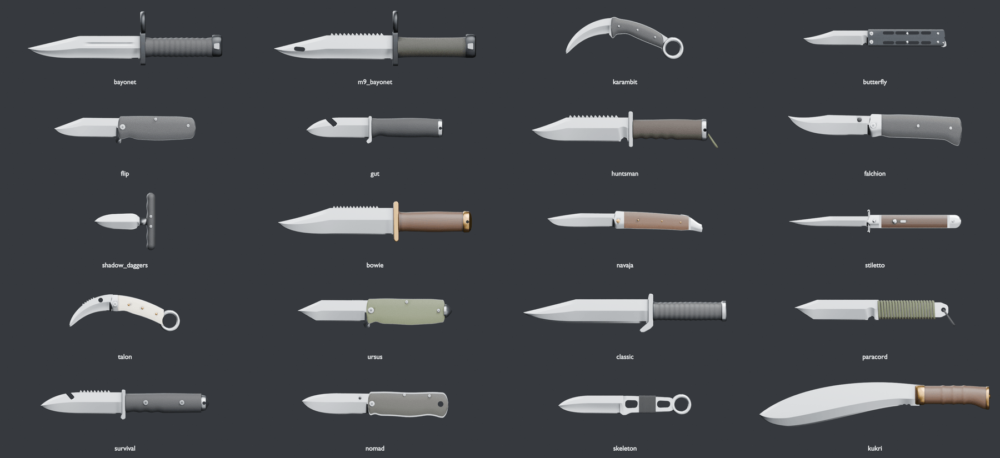
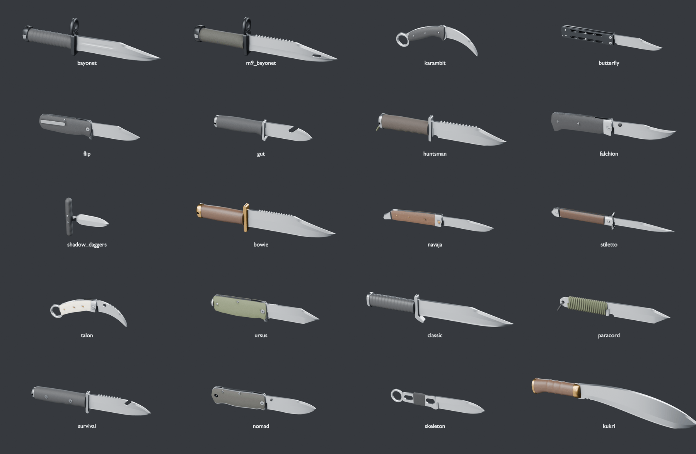
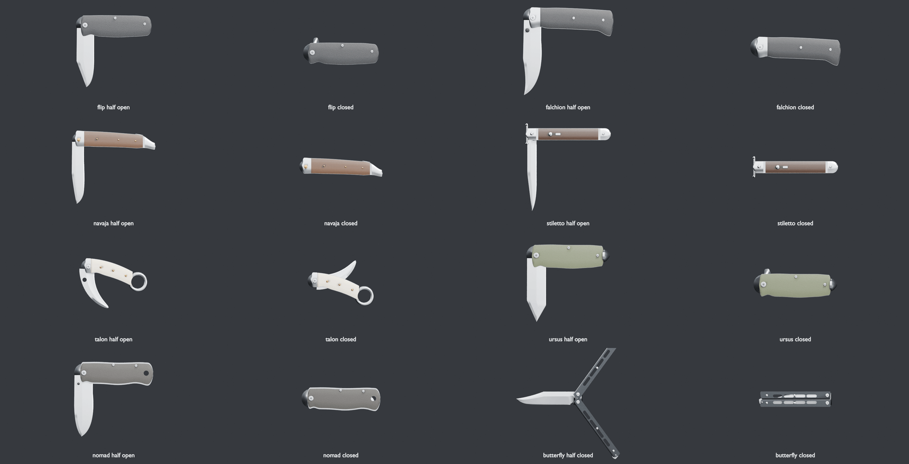
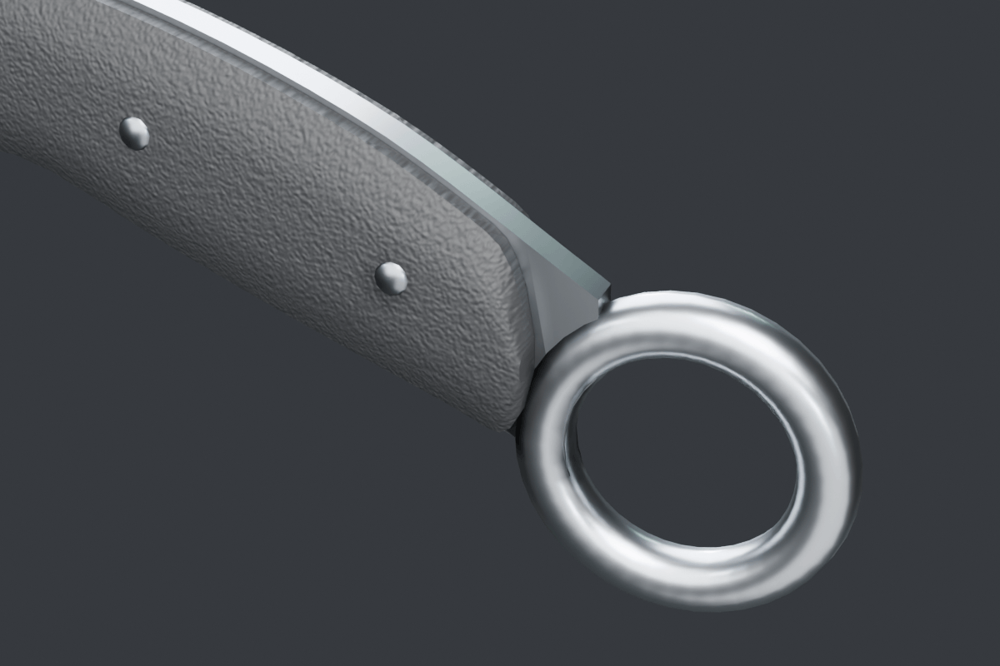
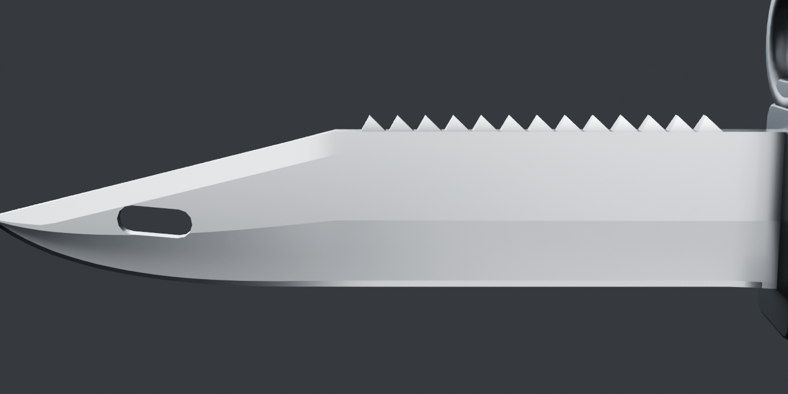
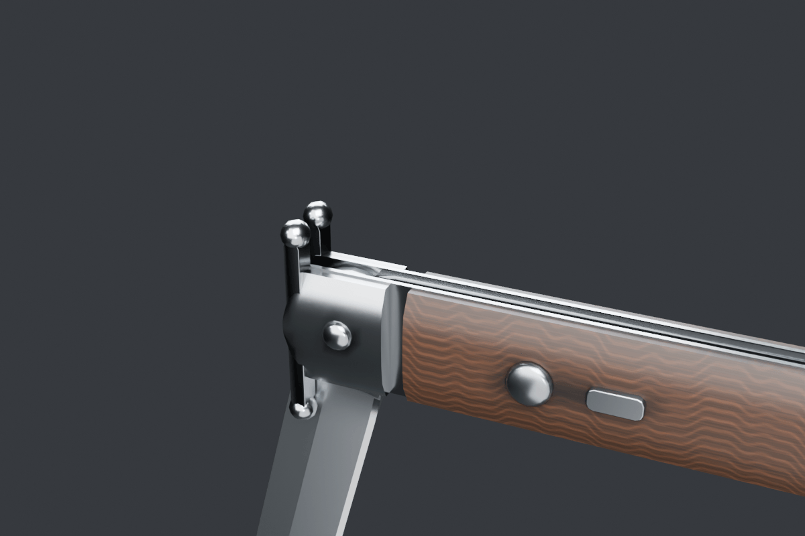
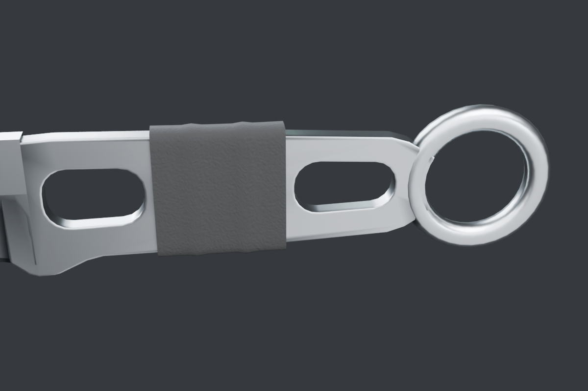

# Knife models (v2)

All 20 knives in `public/knives/<id>.glb` are original geometry built by
committed Blender scripts. Nothing is imported: no Valve or Counter-Strike
meshes, textures or screenshots were downloaded or used. Each knife follows the
real-world knife CS2 patterned it on (listed below) plus CS2's published item
descriptions, the same way the firearms follow real guns. The only texture maps
are small generated ones (pebble, checkering, G10 grain, paracord braid, wood
grain), all made with numpy in `klib.py`.

The files follow [the knife asset contract](knife-contract.md). The runtime
still builds the old procedural knives (`src/cosmetics/ProceduralKnife.ts`)
until the viewmodel switches over.

## Rebuild

```bash
# all 20 raw glbs into .blender-tmp/knives (about 7 s on the M5, ao bake included)
blender -b --factory-startup --python-exit-code 1 -P tools/blender/knives/build_knives.py
# or a few: ... build_knives.py -- karambit talon [--no-ao] [--quick]
npx tsx tools/blender/knives/optimize_knives.ts          # -> public/knives/<id>.glb (meshopt, webp 512)
npx vitest run tools/assets/knives.test.ts

# preview sheets (tiles at one scale, a few minutes at 48 samples on the M5)
blender -b --factory-startup --python-exit-code 1 -P tools/blender/knives/render_knives.py -- \
    .blender-tmp/knives .blender-tmp/knives/final side 34 folding closeups --samples 48
node tools/blender/weapons/compress_previews.mjs .blender-tmp/knives/final docs/screenshots/knives 1800
```

`--quick` skips the bake and writes a side and 3/4 render per knife to
`.blender-tmp/knives/quick/`. The export is deterministic.

## How they are built

`tools/blender/knives/klib.py` holds the knife helpers on top of
`weapons/wlib.py`; `build_knives.py` has one function per knife.

- **Frame.** Everything is authored in millimetres in the contract frame: +X
  from the guard to the tip, +Y spine, the edge faces -Y, Z is thickness. The
  origin is the front of the handle on the edge heel line, so the blade spans
  about `y = 0` (edge) to `y = bladeHeight` (spine) at the heel, like the old
  procedural knives. Blender's axes stand in for the knife frame while
  building; `assemble()` turns the meshes +90 degrees about X so the glTF y-up
  conversion lands them back in knife axes.
- **Blades** are real cross sections (`klib.blade()`): stations run from the
  heel to the tip along the edge and spine curves (paired by arc length, with
  an extra station on every corner so tanto breaks and clip corners stay
  crisp). Each station spans edge to spine with rows for the polished
  secondary bevel (`knife_edge`), the primary grind (flat, or hollow and
  concave), the flats, and either a swedge or a mirrored second edge. The
  grind plunges in over the ricasso, the spine tapers toward the tip, and the
  point closes in every direction. Grind lines are sharp edges, the rest is
  smooth. Fullers are part of the section.
- **Features cut or added:** sawback teeth sit on the spine (0.92 of the local,
  tapered spine thickness, so they never stand proud of the flats); gut hooks
  and line cutters are exact booleans with a V-shaped cutter so the inside of
  the hook is a sharp `knife_edge`; the M9 wire-cutter hole, the talon's thumb
  hole, the kukri's cho and the skeleton's windows are booleans too.
- **Handles** are lofted superellipse sections (moulded grips, ribbed and
  grooved grips, pommels), domed scales on liners (`klib.slab()`), 2D outlines
  with fillets and bevels (guards, bolsters, clips), lathes (rings, pins,
  screws, pommels) and tubes (paracord wrap, lanyards).
- **Folders** get their pivot height from `fit_pivot()`: rotating the blade by
  -PI maps a blade point to `(2px - x, 2py - y)`, so it picks the highest pin
  that keeps the closed edge under the handle's spine line and the closed spine
  above the handle's bottom at every x. The backspacer is then carved to clear
  the closed edge (`back_line()`). The closed tang and any flipper tab stick out
  at the pivot end, as on the real knives.
- **Materials** are the five contract names. Blades are satin steel with a
  brighter polished edge; the finish system replaces them anyway.
- **Ambient occlusion** is baked with Cycles into `COLOR_0` (floor 0.32). The
  static body is baked with everything in place; blades on `blade_pivot` and
  the balisong handles are baked on their own so they don't carry shadows
  into other poses.
- **UV0** is cylindrical on lofts, planar on scales and box-projected
  elsewhere, 3 cm per tile, for the handle textures.

## Nodes and hints

| node | knives | notes |
|---|---|---|
| `<id>` | all | root; carries the userData hints |
| `body` | all | every static part (and the blade on fixed knives) |
| `blade_pivot` + `blade_pivot_mesh` | flip, falchion, navaja, stiletto, talon, ursus, nomad | empty on the pin, `rotation.z` 0 open, -PI closed |
| `handle_safe` / `handle_bite` + `_mesh` | butterfly | empties on the spine-side and edge-side tang pins |
| `socket_grip` | all | centre of a hammer-grip fist, identity rotation |
| `socket_tip` | all | blade point; child of `blade_pivot` on folders |
| `socket_pivot` | folders | pin, same place as `blade_pivot` |
| `socket_pivot_safe` / `_bite` | butterfly | the two tang pins |
| `socket_ring` | karambit, talon, skeleton | ring centre; local +Z is the knife's +Z, the axis a finger goes through |
| `socket_tee` | shadow_daggers | centre of the T-bar, rotated -90 degrees about X so local +Z runs along the bar (knife +Y) |

The skeleton's ring is decorative (CS2's description says a finger can go
through it for stability), so it gets `socket_ring` but keeps `grip: hammer`.
For the push daggers the handle hints are measured on the bar:
`handleLength` is the bar length (along Y, the span the fingers wrap),
`handleHeight` its depth along X and `handleThickness` its thickness along Z.
On every other knife `handleLength` runs from the origin to the butt (to the
start of the ring on ring knives), `handleHeight` is across Y at the grip and
`handleThickness` across Z. `bladeLength` is the blade's reach along +X (so
`u = x / bladeLength` is 0 to 1 over the blade); on the hawkbills the point
itself sits a little short of it and lower. `bladeHeight` is the widest
spine-to-edge distance.

### Sockets and budgets

Positions in millimetres in the knife frame (three.js axes). All sockets and
pivots have z = 0.

| knife | tris | size | `socket_grip` | `socket_tip` | pivots | `socket_ring` |
|---|---:|---:|---|---|---|---|
| bayonet | 6,282 | 116 KB | -62, 18 | 180, 16.5 | | |
| m9_bayonet | 3,998 | 94 KB | -63, 19 | 190, 17 | | |
| karambit | 3,818 | 96 KB | -43, 6.3 | 71.3, -30.7 | | -99.8, -22.4 (inner r 11.5) |
| butterfly | 6,514 | 161 KB | -64, 11.5 | 102, 10.5 | safe -6.5, 18.2; bite -6.5, 4.7 | |
| flip | 3,870 | 103 KB | -62, 14.5 | 100, 13.5 | -9, 15.9 | |
| gut | 3,132 | 77 KB | -58, 16 | 100, 12 | | |
| huntsman | 4,010 | 90 KB | -62, 19 | 155, 18 | | |
| falchion | 4,658 | 113 KB | -66, 13.8 | 128, 30 | -8, 14.7 | |
| shadow_daggers | 3,074 | 82 KB | -24, 13 | 66, 13 | tee -24, 13 | |
| bowie | 2,936 | 54 KB | -60, 20 | 185, 19 | | |
| navaja | 3,918 | 72 KB | -62, 9.4 | 105, 13 | -8, 9.5 | |
| stiletto | 4,222 | 77 KB | -70, 8 | 125, 8 | -11, 8.6 | |
| talon | 4,974 | 115 KB | -42, 7.9 | 64.3, -24.4 | -8, 11.5 | -95.5, -15.3 (inner r 11.5) |
| ursus | 4,052 | 106 KB | -62, 16 | 108, 16.5 | -9, 17.1 | |
| classic | 4,832 | 98 KB | -63, 19 | 200, 17 | | |
| paracord | 3,428 | 64 KB | -52, 16 | 130, 19.5 | | |
| survival | 4,054 | 96 KB | -66, 17 | 130, 13 | | |
| nomad | 4,658 | 115 KB | -62, 15.5 | 104, 20 | -8, 15.8 | |
| skeleton | 3,300 | 86 KB | -44, 14 | 100, 12 | | -97, 14 (inner r 11) |
| kukri | 4,252 | 62 KB | -62, 17 | 250, -14 | | |

Folder tips are given open; closed, a tip lands at `(2px - x, 2py - y)`.





## Knife by knife

Real-world counterparts come from
[the Steam guide "Real Knives of Counter-Strike"](https://steamcommunity.com/sharedfiles/filedetails/?id=2227368716)
unless noted, cross-checked with the
[Counter-Strike wiki](https://counterstrike.fandom.com/wiki/Knife) item
descriptions and
[BladeForums' list](https://www.bladeforums.com/threads/real-versions-of-game-csgo-knives-not-replicas.1791413/).

- **bayonet** (Buck M9, 1991 USMC pattern): 180 mm blade, 36 mm tall, 5.8 mm,
  hollow ground with a long straight false edge into a spear-like clip point,
  a fuller, no saw teeth (that is what separates it from CS2's M9). Black
  oxide crossguard with the muzzle ring over the spine sized for a 22 mm NATO
  flash hider, ring-grooved grip, pommel with the lug slot opening at the butt
  and the two lock-release levers.
  Sources: [M9 bayonet](https://en.wikipedia.org/wiki/M9_bayonet),
  [Phrobis M9A1 trials spec](https://mocityman.com/content/M9Resources/PhrobisM9A1USMCTrialsSpecs.compressed.pdf)
  (7.125 x 1.4375 x 0.23 in blade, 22 mm flash hider, bottle openers),
  [TM 9-1005-237-23&P](https://m9bayonet.com/library/TM9-1005-237-23P.pdf) (left and right release levers),
  [SARCO's M9 notes](https://www.sarcoinc.com/blog/pretty-much-everything-you-wanted-to-know-about-the-m9-bayonet).
- **m9_bayonet** (Smith & Wesson SW3G style M9 with the big backsaw): 190 mm
  clip point, 13 large saw teeth on the spine, the oval wire-cutter hole 1.6 in
  behind the tip, same guard and ring, round knurled grip (generated diamond
  checkering), pommel with lug slot and levers.
  Sources: the M9 patent [US5594967A](https://patents.google.com/patent/US5594967A/en)
  ("an oval wire cutter pivot hole ... about 1-2 inches behind the tip"), the
  trials spec above (2.82 in saw).
- **karambit** (United Cutlery Honshu karambit): hawkbill blade on an 80 mm
  arc, hollow grind with a swedge near the point, jimping, curved full-tang
  handle with a finger-guard hump and thumb rest, a finger groove, scales on a
  steel tang, and the ring at the butt: 23 mm inside diameter (a gloved index
  finger; common rings run 20 to 25.4 mm).
  Sources: [BladeForums on karambit ring size](https://www.bladeforums.com/threads/combat-karambit-finger-hole-width.658642/),
  [Kharma Gen.3X specs](https://www.tacticshop.com/en/kharma-gen3x-venom) (1 in ring),
  [ring size table](https://www.printables.com/model/1010104-tactical-combat-karambit).
- **butterfly** (Terry Guinn Gargoyle-style balisong): 102 mm curved clip point
  with a long concave swedge and a slight recurve, choil, tang with both pivot
  holes and a kicker. Two channel handles with their backs on the grip's
  centre line, so the channels face out when open and wrap the blade when
  closed; drilled walls like the milled titanium originals, pivot screws on
  both pins, zen screws, and the latch on the bite handle.
  Sources: [Squid Industries anatomy](https://www.squidindustries.co/blogs/education-squid-industries/balisong-anatomy),
  [balisong anatomy](https://balisongbutterfly.com/balisong-anatomy-parts-explained)
  (bite handle on the edge side, latch on the bite handle),
  [Benchmade anatomy](https://support.benchmade.com/hc/en-us/articles/24423264139035-Balisong-Anatomy),
  [Gargoyle V2 listing](https://www.pacificedgecutlery.com/balisongs/terry-guinn-gargoyle-v2-gg-019-hybrid-scimitar-recurve/),
  [Gargoyle series thread](https://knifedogs.com/threads/terry-guinn-gargoyle-balisong.45771/).
- **flip** (Benchmade Bedlam 860, simplified the way CS2 does): 100 mm broad
  blade with an angular swedge break (the "tanto-ish" line) and an upswept
  belly, flipper tab that becomes a finger guard when open, G10 scales on
  steel liners, backspacer, torx pivot and screws, tip-up pocket clip on the
  +Z side (first person sees -Z).
  Source: [Bedlam 860 specs](https://www.gpknives.com/benchmade-bedlam-860-satin-plain-edge-g10-knife.html).
- **gut** (Buck 193 Alpha Hunter): 100 mm drop point, the gut hook cut into the
  dropping spine with its lip overhanging toward the handle and a sharpened
  V inside, small steel guard with a forward hook, pebbled rubber grip with a
  finger groove, steel butt cap with a lanyard hole.
  Source: [Steam guide (2015)](https://steamcommunity.com/sharedfiles/filedetails/?id=396248292).
- **huntsman** (MTech Xtreme MX-8054, itself a copy of the DiAlex H.E.C.K.):
  155 mm clip point with a concave swedge, 12 saw teeth, a finger choil at the
  heel, steel double guard, four finger grooves in the rubber grip, pommel
  with a lanyard loop.
  Source: [CS wiki](https://counterstrike.fandom.com/wiki/Huntsman_Knife).
- **falchion** (Cold Steel Espada): folder with a falchion-like blade whose belly
  sweeps up to a point level with the spine after a concave clip, polished
  bolsters, G10 scales, a curved pistol-grip handle with the hooked butt,
  thumb disc.
  Sources: [Espada Large specs](https://www.bladehq.com/item--Cold-Steel-Espada-Large-Lockback--31766),
  [KnifeCenter](https://www.knifecenter.com/item/CS62MB/cold-steel-62mb-large-espada-folding-knife-s35vn-satin-blade-polished-g10-handles-with-aluminum-bolsters).
- **shadow_daggers** (Gerber Uppercut push dagger): 66 mm double-edged spear
  with a diamond section, a narrow stem that passes between the middle and ring
  fingers, and the T-bar across the palm in the blade's plane with four finger
  grooves on the blade side. One dagger per file, `pair: true`.
- **bowie** (Aitor Oso Negro): 185 mm clip point with a deep belly, a concave
  swedge and a sawback (CS2: "full-tang sawback Bowie"), brass guard and
  pommel, wood-look handle.
  Sources: [Aitor](https://knivesaitor.com/en/product/oso-negro/) (185 mm,
  double saw, brass guard and pommel), [CS wiki](https://counterstrike.fandom.com/wiki/Bowie_Knife).
- **navaja** (Emerson Gypsy Jack custom, a modern navaja): slim 105 mm clip
  point with a recurve, curved handle tapering into a downturned tail, metal
  front bolster and tail cap, wood scales with brass pins, the back spring and
  its lock lever on the spine.
  Sources: [Navaja](https://en.wikipedia.org/wiki/Navaja),
  [Gypsy Jack specs](https://knifecritic.com/product/emerson-gypsy-jack).
- **stiletto** (Frank Beltrame 11 in Italian stiletto): 125 mm bayonet blade,
  flat grind on the edge side and a long swedge (the false edge) on the spine,
  swinging open around `blade_pivot` like a side-opening switchblade. Front and
  rear bolsters, quillons with ball ends split either side of the blade slot,
  wood scales, the push button and the sliding safety on the show side, the
  back spring along the spine.
  Sources: [stiletto mechanism](https://stiletto-italiano.com/eng/stilettoscheme.htm),
  [AKC 9 in specs](https://www.bladehq.com/item--AKC-Swinguard-9-Auto-Italian--189012),
  [swivel bolster release](https://knivesatlanta.com/akc-italy-9-stag-bayonet-swivel-release-stiletto/).
- **talon** (Kiaslore Tiger Claw with ivory scales): folding hawkbill with
  saw-tooth ridges on the spine and a thumb hole, ivory scales with brass
  rivets (CS2: "ivory-handled karambit features brass rivets and saw-tooth
  ridges"), steel bolsters and liners, and the steel ring at the butt, 23 mm
  inside.
  Source: [CS wiki](https://counterstrike.fandom.com/wiki/Talon_Knife).
- **ursus** (Gerber Prodigy tanto): tanto-style faceted blade with jimping,
  military green G10, impact pommel. Built as a folder because the contract
  lists it with the folders (see below).
  Source: [CS wiki](https://counterstrike.fandom.com/wiki/Ursus_Knife).
- **classic** (Mick Strider's Badlands Bowie, the CS 1.6 and Source knife):
  200 mm clip point, a wide polished edge band after the original's
  press-fit Stellite edge, a guard whose lower quillon sweeps forward, a ribbed
  handle and a flat pommel.
  Source: [CS wiki](https://counterstrike.fandom.com/wiki/Classic_Knife).
- **paracord** (Linton Seal Tactical / TOPS SWAT Spike tanto type): 130 mm
  clipped tanto with a swedge and a finger choil, the tang wrapped in olive
  paracord (a real helix over a braid normal map), the exposed tang end with
  a lanyard hole and a black cord loop.
  Sources: [CS wiki](https://counterstrike.fandom.com/wiki/Paracord_Knife),
  [cs.money on the Shattered Web knives](https://cs.money/blog/cs-go-skins/500-days-without-new-knives/).
- **survival** (FKMD Navita dive / combat knife, and its Weyland copy): 130 mm
  drop point with a sawback, a line cutter (gut hook) on the spine, integral
  guard, finger-grooved composite handle held by two hex bolts, steel butt
  cap with a lanyard hole and a glass-breaker point.
  Sources: [CS wiki](https://counterstrike.fandom.com/wiki/Survival_Knife)
  ("serrated edge ... plus a sharp gutting hook. The composite material handle
  is bolted to the blade with hex nuts"),
  [FKMD Navita](https://medium.com/@bladebattalion/fkmd-navita-diving-combat-knife-e67eca5a1d27),
  [FKMD handle bolts](https://hardcorecampingtools.blogspot.com/search/label/FKMD).
- **nomad** ("Strider B46" type): lockback folder with a broad, curved blade
  and upswept point, ergonomic handle with a finger choil, composite inserts
  set in an exposed steel frame, the lock bar along the spine, thumb stud and
  a lined lanyard hole at the butt.
  Source: [CS wiki](https://counterstrike.fandom.com/wiki/Nomad_Knife)
  ("ergonomic tactical hunting lock-blade knife features composite handle
  inserts and a broad, sturdy blade").
- **skeleton** (HX Outdoors Q-03 / Renegade G4 Stryker type): one piece of
  steel, hollow-ground drop point, the skeletonized handle with two windows,
  grip tape between them, and the ring at the butt (22 mm inside).
  Source: [CS wiki](https://counterstrike.fandom.com/wiki/Skeleton_Knife)
  ("skeletonized-tang knife has been taped at the handle ... The hole allows a
  finger to be threaded through").
- **kukri** (Elk Ridge style handle, traditional Nepali blade): 250 mm blade
  that bends forward and down, widest (54 mm) at the belly, 8.5 mm spine
  tapering to about 3 mm, the "3"-shaped cho notch at the base of the edge,
  brass bolster, wood handle with three raised rings and a flared butt, flat
  butt cap with the tang peen.
  Sources: [Kukri](https://en.wikipedia.org/wiki/Khukri),
  [kukri terminology](https://everestforge.com/kukri-khukuri-terminology-guide),
  [KHHI booklet](https://www.thekhukurihouse.com/blog/kukri-knife-booklet).

Close-ups:






## Known deviations and simplifications

- **Ursus mechanism.** CS2's Ursus is a fixed blade ("No fuss, no moving
  parts"), but the contract lists it with the folders, so it ships with
  `blade_pivot` and folds. The blade is 108 mm instead of the Prodigy's
  120 mm so it can close inside the handle. Setting `URSUS_FOLDER = False` in
  `build_knives.py` makes it fixed; the contract and the viewmodel would need
  the same change.
- **Survival knife.** The references describe a bolted composite handle and a
  gutting hook (the FKMD Navita), not a hollow handle with a compass cap, so
  it follows the references.
- **M9 wire-cutter hole** sits near the tip (1-2 in behind it, per the
  patent), not near the guard. There is no hook on the blade; on the real M9
  the hooked lug is on the scabbard.
- **Sizes.** Real-world sizes, except where a counterpart is out of scale for
  the set: the classic is 200 mm (the Badlands Bowie is 254 mm), the kukri
  250 mm (a standard 10 in kukri; the Elk Ridge 13 in model is 330 mm), and
  the paracord 130 mm (the Linton listing says 250 mm).
- **Talon closed.** A hawkbill rotated by -PI curves the other way, so the
  closed talon's point stands out of the handle's spine. Real folding
  karambits curve the handle to match; the contract's single -PI hinge can't.
- **Balisong closed.** The handles close exactly around the blade, but the
  latch is modelled in its stowed position only.
- **Balisong swing direction (for the viewmodel).** The contract says
  `handle_safe` closes to +PI and `handle_bite` to -PI. With the safe handle on
  the spine-side pin, a positive `rotation.z` (counter-clockwise seen from +Z)
  swings its butt down through the edge side, so with those signs the two
  handles pass through each other half way. -PI for `handle_safe` and +PI for
  `handle_bite` swing them round the spine and the edge without crossing. The
  closed pose is the same either way; the folding sheet shows the
  non-crossing direction.
- **Hidden mechanisms** (liner and back locks, detents, springs inside
  handles) are only shown where they are visible from outside.
- **Textures.** Handles use small generated normal or colour maps with tiling
  UVs, which the optimizer keeps as float UVs (a few KB more per knife).
