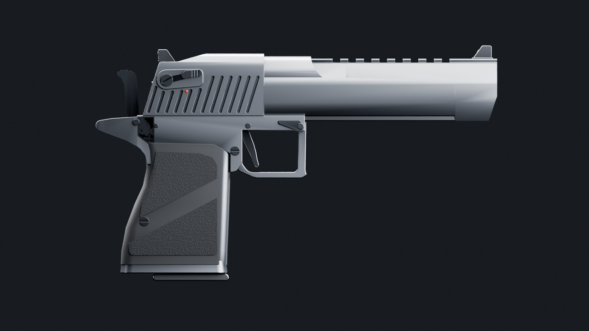
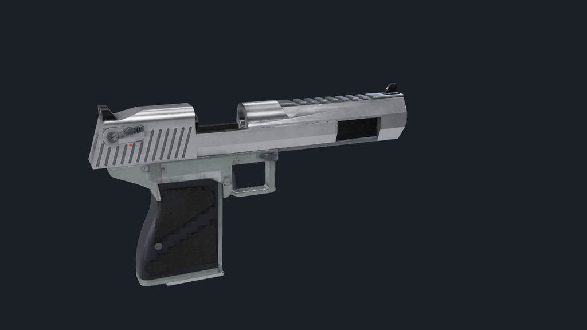

# Weapon and knife models (v2)

All of these models are original. The two firearms are built by committed
Blender scripts from 2D outlines, lathes and booleans. The 20 knives are built
in TypeScript at runtime. Nothing is imported: no Valve or Counter-Strike
assets, no Sketchfab rigs, no downloaded meshes. The designs follow real-world
firearm and knife layouts (a heavy .50 gas pistol, a bolt-action magnum with a
thumbhole stock, common knife styles), the same way any shooter models a real
gun, but every vertex comes from code in this repo. The firearm textures are
baked by the scripts. Three CC0 ambientCG maps (Scratches005, Metal009 and
Plastic012B, downscaled in `tools/blender/weapons/textures/`, listed in
`CREDITS.md`) feed the bake as scratch and micro roughness detail.

Display names stay "AWP" and "Deagle".

## Rebuild

```bash
# firearms (blender 5.2 lts). --renders writes the preview pngs, omit it for a faster build
blender -b --factory-startup --python-exit-code 1 -P tools/blender/weapons/build_deagle.py -- --renders .blender-tmp/weapons/final
blender -b --factory-startup --python-exit-code 1 -P tools/blender/weapons/build_awp.py -- --renders .blender-tmp/weapons/final
# optimize with png kept (--no-webp) so ktx2 encodes from lossless sources, then ktx2 last
npx tsx tools/assets/optimize-glb.ts .blender-tmp/weapons/deagle_raw.glb public/viewmodels/v2/deagle.glb --texture-size 1024 --no-webp
KTX2_UASTC_NORMALS=1 npx tsx tools/assets/ktx2-textures.ts public/viewmodels/v2/deagle.glb public/viewmodels/v2/deagle.glb
npx tsx tools/assets/optimize-glb.ts .blender-tmp/weapons/awp_raw.glb public/viewmodels/v2/awp.glb --texture-size 1024 --no-webp
npx tsx tools/assets/ktx2-textures.ts public/viewmodels/v2/awp.glb public/viewmodels/v2/awp.glb
node tools/blender/weapons/compress_previews.mjs .blender-tmp/weapons/final docs/screenshots/weapons 1280
npx vitest run tools/assets/weapons.test.ts tools/assets/budgets.test.ts

# quick iteration: no high poly or bake, flat materials, orthographic left/right/top/front + 3/4 + first person
# in .blender-tmp/weapons/ (the deagle also writes deagle_ref_right.png, a right side at 4 px per mm)
blender -b --factory-startup --python-exit-code 1 -P tools/blender/weapons/build_deagle.py -- --quick
```

The ktx2 step must run last: running the optimizer again afterwards would
re-encode the textures. The Deagle's normal map uses UASTC
(`KTX2_UASTC_NORMALS=1`). With ETC1S the long flat barrel and slide faces
broke into sawtooth streaks in game, because ETC1S can't hold the smooth
normal gradients along thin uv islands. UASTC costs about 460 KB more and
the file still fits under 1.5 MB. The AWP keeps ETC1S normals: with UASTC it
came to 1,579 KB, over the budget, and in game its round and ribbed parts
don't show the streaks the Deagle's long flats did.

A full build (high poly, uv atlas and ten bake passes at 2048) takes about 5
minutes per gun on the M5 when the machine is otherwise idle. The preview
renders (Cycles on Metal) add a few more. `--size 1024` bakes faster for
iteration. `--quick` skips the high poly and the bake and takes about 30 s.

## Katana

`tools/blender/weapons/build_katana.py` builds `public/viewmodels/v2/katana.glb`
with the same high to low bake as the guns: a 70 cm blued blade with about
18 mm of curve, a polished edge bevel, an emissive channel down each flat, an
angular guard, chrome collars and a diamond wrap over a red underlay (the wrap
only lives in the high poly and the bake). It is an original design; no models
were downloaded. It is authored in the knife frame (+x to the tip, +y the
spine) so `knifeGripSpec('hammer')` fits both hands: `socket_grip_r` is the
middle of the right fist behind the guard, `socket_grip_l` the left fist near
the pommel. The glow keeps its own emissive material outside the atlas.
Remote players hold the same GLB in third person when their snapshot row says
`weapon: 'katana'`.

```bash
blender -b --factory-startup --python-exit-code 1 -P tools/blender/weapons/build_katana.py -- --renders .blender-tmp/weapons/katana
npx tsx tools/assets/optimize-glb.ts .blender-tmp/weapons/katana_raw.glb public/viewmodels/v2/katana.glb --texture-size 1024 --no-webp
KTX2_UASTC_NORMALS=1 npx tsx tools/assets/ktx2-textures.ts public/viewmodels/v2/katana.glb public/viewmodels/v2/katana.glb
```

## How the firearms are built

`tools/blender/weapons/wlib.py` holds the helpers, and each build script only
describes its gun.

- **Units and axes** follow `tools/blender/README.md`: metres, barrel along
  Blender +Y, top +Z. The scripts author in millimetres in a design frame
  (bore axis at z = 0), then shift everything so the **weapon origin is
  `socket_grip_r`**. Hands can attach with no extra offset.
- **Shapes** are side outlines (prisms across X), front sections (prisms along
  the barrel), lofts and lathes. Corners use real fillets in 2D. Exact
  booleans cut serrations, ports, rail slots, flutes, the magwell and screw
  recesses.
- **Curves** get their segment counts from a chord tolerance instead of fixed
  numbers: a fillet or lathe gets as many segments as it needs to stay within
  0.05 mm (fillets) or 0.03 mm (lathes) of the true arc on the low poly (0.05
  mm on the AWP's lathes, which keeps it near 40k triangles). So big radii
  like the hood, the guard and the scope bells stop faceting, and 1 mm pins
  stay cheap. Polygons of 8 sides or fewer (hex nuts) are left alone. The
  grip is lofted through catmull-rom steps between the measured sections, so
  the palm swell has no loft kinks.
- **Edges** use an angle-limited bevel with hardened normals, so no box edge
  is left raw. Bevels of 0.8 mm and up get 2 segments on the low poly (2 mm
  and up get 3). The Deagle's guard is bevelled 1.6 mm so it reads as a round
  bar, and the AWP's stock 4.5 mm like moulded polymer. Creases under the
  bevel angle between two wide faces are marked sharp, because a smooth
  28 degree crease bends the normals across the whole face next to it.
- **Two builds, one bake.** Each script builds the gun twice from the same
  functions. The low poly ships. The high poly has 3x finer curves, 3 to 5
  segment round bevels and detail that only lives in the bake: anti-glare
  lines on the rear sight, ridges on the safety paddle, slide stop and
  magazine release, the grip screw slots, hex sockets in the AWP's screws,
  knurled turret caps, diopter ring and cheek wheel, white filled click marks
  around the turret skirts, and shader bump for grip stipple and polymer or
  rubber grain.
- **UV atlas**: the low poly is triangulated, split into islands by smart
  project (66 degrees), re-unwrapped with minimum stretch, scaled to equal
  texel density and then weighted by distance from the eye at the idle pose
  (with less for the Deagle grip rubber and magazine and the AWP stock), and
  packed into one square for all parts.
- **Bakes** (Cycles, selected to active, 0.3 mm cage, 0.8 mm reach, 2048
  square) from the high poly onto the atlas: tangent space normal (OpenGL,
  +Y), and emission passes for each finish's base colour, wear colour,
  roughness, metalness and wear, grime and breakup strengths, a mask pass
  (ambient occlusion over 12 mm against every part, convex edges from
  occlusion inside the mesh, cavities from short range occlusion) and detail
  passes (CC0 scratch, brushed steel and plastic roughness maps projected
  triplanar in object space with the brushing along the bore, plus
  procedural grunge and smudge noise). The low polys are hidden from rays so
  only the high poly occludes. The magazine is baked on its own, so it
  doesn't look dirty when it drops out.
- **Compositing** (numpy, `compose_textures` in `wlib.py`): convex edges broken
  up by noise wear through to the wear colour and roughness (bare steel on
  nitride and anodising, polished edges on stainless, lighter scuffs on
  polymer). Cavities get grime, scratches and smudges break up the
  roughness, and a little AO goes into the base colour so crevices stay dark
  under the direct lights. Empty texels are dilated from their neighbours.
  Then everything is box filtered down to what ships: base colour 1024,
  normal 1024 (renormalised), ORM 512 (R occlusion, G roughness, B
  metalness).
- **One material per gun** (`mat_deagle`, `mat_awp`), single sided, so each
  moving part is one draw call. The GLB carries tangents from Blender's
  mikktspace, so three.js shades the normal map in the frame it was baked
  in. There is no vertex AO any more: it's in the ORM map.
- **Moving parts are empties on the pivot with the mesh in a child named
  `<part>_mesh`.** `optimize-glb.ts` runs gltf-transform `meshopt()`. Inside
  it, `quantize()` folds a scale and offset into the matrix of every mesh
  node that has no children, which moves a leaf node's origin to its bounding
  box centre. A `trigger` or `hammer` mesh with its origin on the pin would
  then rotate about the wrong point. The named empty keeps the exact pivot,
  and only the unnamed quantization transform lands on `<part>_mesh`.
  `prune` in the optimizer keeps socket empties (`keepLeaves: true`). I
  checked every socket and pivot after optimization, and
  `tools/assets/weapons.test.ts` asserts it.
- **Animation hints** are stored as custom properties, which become glTF
  extras and then three.js `userData`. Directions and angles are in three.js
  axes.

### LOD

There is only LOD0. Nothing but the first person viewmodel
(`src/viewmodel/ViewmodelSystem.ts`) and the dev preview load these GLBs.
Remote players carry the procedural knife, and the menu shows player models.
A viewmodel always sits at the same distance from the camera, so a lower LOD
would never be picked. If third person guns show up later, a `--simplify`
pass in `optimize-glb.ts` on the same atlas would be the place to start.

### Finishes

These are the finishes in the build scripts (`W.finish(...)`). Each one drives
the bake (base and wear colour, roughness, metalness, how much it wears, grime,
roughness breakup, scratches and micro surface). They all end up in the one
atlas material per gun, so the GLB only has `mat_deagle` or `mat_awp`.
`--quick` builds still render them as flat materials.

| finish | used for |
|--------|----------|
| `mat_stainless` | satin stainless: Deagle slide, barrel, rail, magazine (the default finish) |
| `mat_stainless_frame` | Deagle frame, guard, beavertail and grip core (rougher satin, the second tone) |
| `mat_sight_black` | Deagle front and rear sights, matte black so the dots read |
| `mat_steel_dark` | black nitride: AWP receiver, barrel, brake, rail, bipod; the Deagle's slide, barrel, sights and magazine with `--finish black` |
| `mat_gunmetal` | the Deagle frame with `--finish black` |
| `mat_steel` | pins, screws, levers, safety, hammer, trigger, Deagle bolt head and rear plate, polished AWP bolt |
| `mat_grip` | Deagle raised stippled grip fields (stipple baked from shader bump) |
| `mat_polymer_green`, `mat_polymer_green_stipple` | AWP stock, cheek rest, stippled grip and forend panels |
| `mat_aluminium` | AWP chassis rail, guard, magwell lip, rings, bipod mount, cheek wheel |
| `mat_scope` | scope tube, turrets, saddle |
| `mat_scope_knurl` | diopter ring and turret caps (same anodising, much less wear, since every knurl ridge counts as an edge) |
| `mat_glass` | dark tinted domed lenses (opaque, so the tube never looks hollow) |
| `mat_rubber`, `mat_polymer_black` | Deagle smooth grip rubber; AWP butt pad, eye cup, bipod feet, bolt knob |
| `mat_sight_dot`, `mat_paint_white`, `mat_indicator`, `mat_paint_red`, `mat_brass` | sight dots, turret marks, AWP cocking indicator, Deagle fire dot, top round in each magazine |

## Deagle (`public/viewmodels/v2/deagle.glb`)

Heavy .50 gas pistol laid out like the Magnum Research Desert Eagle Mark XIX
with the 6 in barrel. The sizes follow the published Mark XIX numbers (273 mm
long, 159 mm tall, 32 mm slide, 70 mm trigger reach, fixed barrel). The
proportions come from real side, front and 3/4 photos: Wikimedia Commons
pictures and Magnum Research product shots, used only as a size and
silhouette reference and never committed. The build renders an orthographic
right side at 4 px per mm (`deagle_side.png`). I laid a side photo over it at
the same scale and matched the outline to within 2 or 3 mm.

- **Barrel** (fixed, part of `body`): the classic trapezoid section. The
  sides are vertical up to a long horizontal edge, then the flanks slope in
  to the rail. The Picatinny style rail is cut into the top: 8 slots, 10.6 mm
  apart, with a dovetail undercut on the sides. Behind the rail the round
  chamber section stands proud of the flanks, and the flank cut runs out over
  it in a curved scoop. The front block under the muzzle comes down over the
  end of the frame. It has chamfered lower corners and a slanted lower front
  face. There is a crowned bore, a chamber mouth at the breech (seen with the
  slide back), a gas block between the slide arms, and a front sight blade in
  a dovetail base with a dot.
- **Slide:** the rear block has a slanted rear face and 12 slanted serrations
  a side, leaning 17.4° like the rear face. The ones under the safety stop
  short of it. A low deck carries the rear sight (square notch, two dots,
  anti-glare lines), then a long ramp rises to the hood that wraps the
  chamber. The slanted rear face has a plate and the firing pin, and the
  hood's front face has a rotating bolt head with lugs. The ambidextrous
  safety has a teardrop plate, a slotted hub, a ridged paddle and a red fire
  dot. The slide arms run forward under the barrel on both sides to the front
  block, with the same lower chamfer.
- **Frame:** dust cover rails, a squared trigger guard with a slight hook at
  the front, and a beavertail with a curved web under it over the hammer
  slot. On the left there is the long slide stop with a ridged thumb pad, the
  barrel release button and a ridged magazine release. On the right there is
  the barrel release lever and the magazine release's other end. Trigger,
  hammer and sear pins go through both sides.
- **Grip:** the front strap is nearly upright and the back flares into a palm
  swell. A metal grip core shows at the front strap, under a rubber
  wraparound over the sides and back. The rubber has raised stippled fields
  split by the smooth diagonal band of the stock grip, and a slotted screw on
  each side. A frame lip sits under it.
- **Moving parts:** a spur hammer with a serrated spur (cocked at rest), a
  curved trigger blade, and a magazine with witness holes, feed lips, a .50 AE
  round on top and a floorplate square to the grip bottom.

- Size: 273 mm long, 160 mm tall (front sight to floorplate), 37 mm wide over
  the safety levers (the slide is 32 mm). The bore is 158 mm from the breech
  face to the muzzle.
- Triangles: 28,278 (body 14,572, slide 10,254, hammer 1,312, trigger 396,
  mag 1,744), 5 draw calls. The high poly it's baked from is 84,414. The
  earlier flat shaded model was 16,406 triangles and 235 KB.
- Textures: one atlas baked at 2048 and shipped as ktx2: base colour 1024
  (etc1s), normal 1024 (uastc, see Rebuild), ORM 512 (etc1s). The atlas
  averages 3.5 texels per mm at 2048, more on the slide and hammer, less on
  the grip rubber and the magazine. The file is 1,314 KB (3.0 MB of gpu
  texture memory once transcoded).
- Finish: satin stainless by default, with a rougher satin frame, darker steel
  controls and matte black sights. `--finish black` builds the black nitride
  version. The black one read as a near black shape against the bright maps
  once the viewmodel took the world's light (a 0.03 reflectance metal
  reflects almost nothing), so stainless is the shipped finish.
- Finishes: the slide and barrel are satin stainless brushed along the bore
  (roughness 0.28, polished to 0.16 on worn edges), the frame a rougher bead
  blast (0.4). The rubber is dielectric at roughness 0.62 (smooth, with a
  fine grain) and 0.85 (stippled). None of it is tuned to one environment
  map.
- Nodes: `deagle` (root), then `body` (static mesh), `slide`, `hammer`,
  `trigger`, `mag` (pivot empties with `_mesh` children), and the sockets.
- The build prints a clearance check. It poses the hammer fired and the
  trigger pulled the way the runtime does, and counts triangle overlaps with
  the slide and the frame. The only contact left is the hammer face on the
  firing pin.

Socket and pivot positions, in three.js axes (+X right, +Y up, -Z forward,
metres), relative to `socket_grip_r`, which is the origin:

| node | parent | position | notes |
|------|--------|----------|-------|
| `socket_grip_r` | deagle | 0, 0, 0 | rotated -4° about X: local +Y runs up the front strap (0, 0.998, -0.070) |
| `socket_grip_l` | deagle | -0.0168, -0.0010, -0.0080 | support palm on the left grip panel under the guard |
| `socket_trigger` | deagle | 0, 0.0188, -0.0457 | centre of the trigger face |
| `socket_muzzle` | deagle | 0, 0.0668, -0.2096 | bore exit, forward is -Z |
| `socket_eject` | deagle | 0.0160, 0.0718, -0.0291 | right side of the hood, where the case leaves with the slide back |
| `socket_mag_bottom` | mag | 0, -0.0717, -0.0016 | floorplate centre, in world terms (local to `mag`: 0, -0.1095, 0.0033) |
| `socket_slide_rear` | slide | 0, 0.0568, -0.0051 | middle of the serration band, in world terms (local to `slide`: 0, -0.0100, -0.0280) |
| `slide` | deagle | 0, 0.0668, 0.0229 | on the bore axis where the slanted rear face crosses it |
| `hammer` | deagle | 0, 0.0363, 0.0354 | hammer pin |
| `trigger` | deagle | 0, 0.0338, -0.0406 | trigger pin |
| `mag` | deagle | 0, 0.0378, -0.0049 | top of the magazine on its axis |

`socket_grip_r` sits on the grip centreline, 66.8 mm below the bore. It leans
with the front strap the fingers wrap, not with the grip's centreline, which
rakes about 10° because of the palm swell. With a 10° socket the hand's index
finger pointed down into the bottom of the guard. The Deagle also has its own
right hand pose, `deagle` in `src/viewmodel/handPoses.ts`. Its trigger sits
close in front of the deep grip, so the first index segment lies along the
frame and the finger bends in at the middle joint onto the trigger face. The
AWP has its own grip, forend and bolt poses in the same file. All gun poses
were fitted offline against the shipped meshes, so each finger segment rests
within about 1 mm of the surface it touches.

Animation hints (`userData`):

- `slide`: `travel_m` 0.045. Move `position.z` by up to +0.045 (backwards).
  The barrel stays put. With the slide back you see the chamber mouth, the
  bolt head and the gas block between the arms.
- `hammer`: `fire_rot_x_deg` -21. The rest pose is cocked, and a negative
  `rotation.x` drops it forward onto the firing pin. The slide should push it
  back past rest while it cycles, which hides it inside the slide.
- `trigger`: `pull_rot_x_deg` -10. A negative `rotation.x` swings the blade
  back into the recess behind it.
- `mag`: `drop_dir` [0, -0.999, 0.044] and `drop_m` 0.16. The magazine drops
  along its own axis, which follows the front strap (2.5°).





## AWP (`public/viewmodels/v2/awp.glb`)

Bolt-action magnum, laid out like a thumbhole-stock precision rifle:

- **Stock:** green polymer stock with a stippled pistol grip, a cheek rest
  on two posts with an adjuster wheel, an aluminium spacer and a rubber butt
  pad. The forend is vented, with a stippled support-hand panel, and there
  are sling studs.
- **Chassis:** an aluminium rail under the receiver, plus the trigger guard,
  magwell lip and magazine release.
- **Action and barrel:** the steel receiver has an ejection port, a bolt
  release, a safety and screws. The fluted barrel (6 flutes) has a shank
  collar and a ported muzzle brake. The bolt has a polished body with flutes,
  a dark shroud with a red cocking indicator, and an angled handle with a
  round black knob. The detachable box magazine has ribs and a .338 round on
  top. A folded bipod sits under the forend.
- **Scope:** 350 mm long with a 50 mm objective (59 mm bell). It has a
  knurled diopter ring, a ribbed power ring with a throw lever and a rubber
  eye cup. The saddle carries elevation, windage and parallax turrets with
  knurled caps and white zero marks. Two rings on the rail have clamp nuts
  and cap screws. The lenses are domed tinted glass.

- Size: 1,185 mm long, 249 mm tall including the scope, 102 mm wide
  including the bolt knob. The barrel is 660 mm from the breech to the
  crown, and the brake adds 70 mm.
- Triangles: 39,222 (body 34,534, bolt 2,888, trigger 224, mag 1,576), 4
  draw calls. The high poly it's baked from is 213,903. The earlier model
  was 25,188 triangles and 356 KB.
- Textures: one atlas baked at 2048, shipped as ktx2 etc1s: base colour 1024,
  normal 1024, ORM 512. The atlas averages 1.8 texels per mm at 2048. The
  eyepiece, turrets and action get up to 1.9 times that, and the stock
  (beside and below the camera) and the brake far less. The file is
  1,007 KB (3.0 MB of gpu texture memory).
- Finishes: black nitride steel, anodised aluminium chassis and scope (worn
  edges go to bare metal), a polished bolt, green polymer with a moulded grain
  and stippled panels, and clean glass.
- Nodes: `awp` (root), then `body`, `bolt`, `trigger`, `mag` (pivot empties
  with `_mesh` children), and the sockets.

| node | parent | position | notes |
|------|--------|----------|-------|
| `socket_grip_r` | awp | 0, 0, 0 | rotated -14° about X, local +Y up the pistol grip |
| `socket_grip_l` | awp | 0, 0.0310, -0.3939 | under the forend on the stippled panel, 34 cm ahead of the trigger face |
| `socket_trigger` | awp | 0, 0.0320, -0.0539 | trigger face |
| `socket_muzzle` | awp | 0, 0.0780, -0.8995 | brake exit |
| `socket_eject` | awp | 0.0160, 0.0840, -0.1045 | right side port |
| `socket_scope_eye` | awp | 0, 0.1340, 0.0371 | rear lens centre (scope axis 56 mm above the bore) |
| `socket_mag_bottom` | mag | 0, -0.0080, -0.1545 | baseplate centre (local to `mag`: 0, -0.076, 0) |
| `socket_bolt_knob` | bolt | 0.0540, 0.0460, -0.0015 | knob centre (local to `bolt`: 0.054, -0.032, 0.010) |
| `bolt` | awp | 0, 0.0780, -0.0115 | on the bore axis at the handle root |
| `trigger` | awp | 0, 0.0480, -0.0555 | trigger pin |
| `mag` | awp | 0, 0.0680, -0.1545 | top of the magazine |

Animation hints:

- `bolt`: `lift_rot_z_deg` 60 and `travel_m` 0.1. A positive `rotation.z`
  lifts the handle (that's a rotation about Blender's local Y, the bore).
  Then `position.z` goes up to +0.1 to pull the bolt back. The receiver cut
  lets the handle rise, and the stock wrist and eyepiece clear the full
  stroke.
- `trigger`: `pull_rot_x_deg` -12.
- `mag`: `drop_dir` [0, -1, 0] and `drop_m` 0.12. The magazine drops
  straight down.


### In three.js

`tools/weapon-preview.html` loads the optimized GLBs through
`createGltfLoader()` (meshopt), with the viewmodel lights, fov and room
environment. Params:

- `?weapon=deagle|awp&view=fp|side&sockets=1` picks the weapon and view and
  shows axes on every socket.
- Pose params from 0 to 1 apply the animation hints above: `slide`,
  `hammer`, `trigger`, `mag`, `lift` and `back` (the last two are the bolt).
- `center=x,y,z&dist=m` zooms the side view in on a part.





## Knives (runtime, `src/cosmetics/ProceduralKnife.ts`)

`src/combat/knives.ts` is still the catalog (ids, names, shape parameters,
timings, damage). Three optional fields were added: `mechanism` (`fixed`,
`folder` or `balisong`), `fingerRing` and `grind` (`flat`, `hollow` or
`sabre`). The public API is unchanged: `buildProceduralKnife`,
`disposeProceduralKnife` and `bladeShape`, plus the new `KNIFE_NODES` name
table and `isSharedKnifeTexture`. The frame is unchanged too: +X runs from
the guard to the tip, +Y is the spine, the edge faces -Y, Z is thickness,
units are metres, and the origin is where the hand meets the guard.

The code lives in `src/cosmetics/knife/`:

- `profiles.ts`: each blade profile is an edge curve and a spine curve that
  meet at the tip. Each profile also records where a clip swedge, a second
  edge or the gut hook sits.
- `blade.ts` builds the real cross section. Stations run along both curves,
  and each station spans edge to spine. The section is split into facet
  bands, and each band has its own vertices, so the creases stay crisp.
  From the edge up:
  - the sharp edge with a 1.1 mm polished secondary bevel (its own material,
    it reads as a bright line)
  - a flat or hollow primary grind, with a visible grind line and a curved
    plunge at the ricasso
  - the flats at full thickness, with distal taper toward the tip, closing
    to a point in every direction
  - an optional fuller cut as a real rounded groove, a swedge on clip
    points, a second edge on daggers and push daggers, and a sharpened gut
    hook
  - sawback teeth as separate raked, flat-shaded teeth on the spine
- `parts.ts` has the handle and fitting builders:
  - lofted handles with a superellipse section, finger grooves, a choil,
    swell and flare, kukri rings and pommel caps
  - domed scales on liners, with pins and a flat inner face
  - a helical paracord wrap (a tube along a tight helix around the tang)
    with a lanyard loop
  - crossguards with swept quillons, the muzzle ring, finger rings
  - the skeleton frame, extruded with two cut-outs and bevelled
  - the push dagger tee bar with finger grooves
- `materials.ts`: every knife gets its own `MeshStandardMaterial` set. Parts
  that share a material are merged per moving part, so a knife is 2 to 8
  meshes, or 3 to 9 draw calls counting the blade's polished edge group:
  - satin steel with a brushed roughness and colour map; blades the catalog
    colours dark get a matte coated finish and still show a bright
    sharpened edge
  - rubber with the pebble normal map, G10 scales with a finer grain, wood
    with a grain map, paracord with a braid colour and normal map
  - metal handles, and accents (steel, brass, black coated, or orange G10)
- `textures.ts`: six tiny `DataTexture`s (at most 256x256) are generated
  once and shared by every knife. They are never disposed per knife, so
  disposing one knife can't break another. Materials and geometries are
  per knife and get disposed.

Articulation and sockets (all names are in `KNIFE_NODES`):

| knives | groups | sockets |
|--------|--------|---------|
| all | none | `socket_grip` (centre of a hammer-grip hand on the handle), `socket_tip` |
| flip, talon, navaja, falchion, nomad, ursus, stiletto | `blade_pivot` at the pivot pin; the blade, tang disk, thumb stud and `socket_tip` sit under it | `socket_pivot` |
| butterfly | `handle_safe` and `handle_bite`, each on its own tang pin (spine side and edge side) | `socket_pivot_safe`, `socket_pivot_bite` |
| karambit, talon | `finger_ring` | `socket_ring` (child of `finger_ring`, at its centre) |
| push daggers | none; `userData.pair = true`, build two for dual wield | |

- Folders: `blade_pivot.rotation.z` goes from 0 (open) to -π (closed). The
  folder handles are 1.12 times the blade height, and the pin is placed so
  the closed edge sits under the backspacer.
- Balisong: `handle_safe.rotation.z` goes from 0 to +π (swings over the
  spine) and `handle_bite.rotation.z` from 0 to -π (swings under the edge).
  The latch rides on the bite handle.

Triangles per knife (budget 8,000): bayonet 3,876, flip 3,512, gut 2,488,
karambit 4,216, M9-style 3,592, huntsman 3,056, balisong 2,172, falchion
3,308, push daggers 2,252, bowie 2,840, navaja 3,100, stiletto 4,044, talon
4,440, ursus 3,100, classic 3,044, paracord 3,662, survival 4,182, nomad
2,940, skeleton 2,840, kukri 2,736. Most knives build in 1 to 5 ms in Node.
The first knife that needs a given texture also generates it, which costs up
to about 25 ms once.

Dev tools:

- `tools/knife-gallery.html` renders every knife with the same room
  environment and ACES tone mapping as the viewmodel scene. Open it through
  the dev server; `?fold=0.5` swings the folders and the balisong.
- `tools/blender/weapons/dump_knives.ts` plus `render_knives.py` render the
  same geometry in Blender for close-ups.


## Tests

- `tools/assets/weapons.test.ts` reads the optimized GLBs with the meshopt
  decoder. It checks:
  - every contract node exists once, and the moving sockets have the right
    parents
  - the pivots are clean (no mesh, identity rotation, unit scale, geometry
    in a child)
  - the size is within 10% of the target
  - the barrel points along -Z from the grip, and `socket_grip_r` tilts up
    the rake and sits at the origin
  - the triangle budgets hold (36k Deagle, 42k AWP)
  - every primitive uses the one `mat_*` atlas material with base colour,
    ORM, occlusion and normal textures, and carries uvs and tangents
  - the support hand and scope eye are placed correctly
- `src/cosmetics/__tests__/ProceduralKnife.test.ts` checks:
  - sockets on all 20 knives
  - folders folding about a fixed pin, with the closed edge under the
    backspacer
  - both balisong halves swinging about their own pins
  - finger rings a finger fits through, and the push dagger pair
  - finite, closed, outward-wound meshes under 8k triangles
  - sharp edges with a polished bevel, sawback teeth and the fuller groove
  - disposal that leaves the shared textures alive
- `src/combat/__tests__/knives.test.ts` also checks the mechanism,
  finger-ring and pair flags in the catalog.
