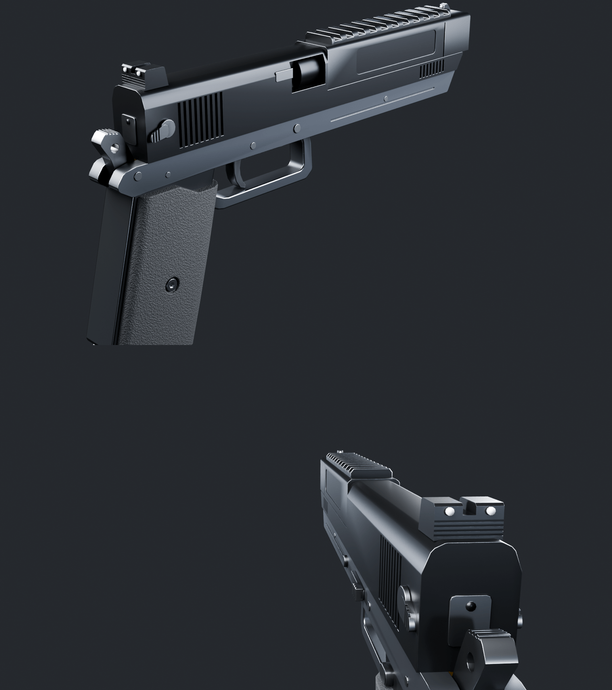
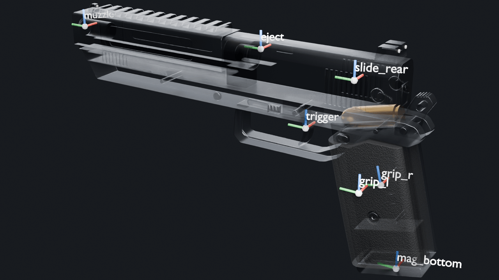
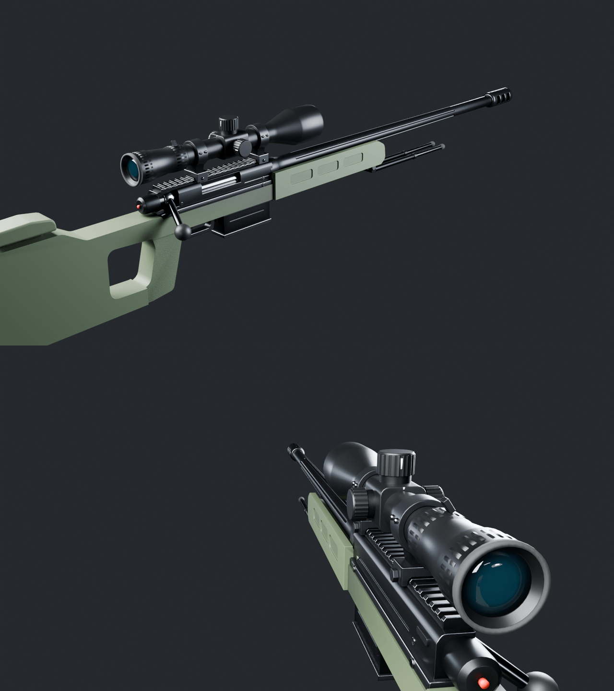
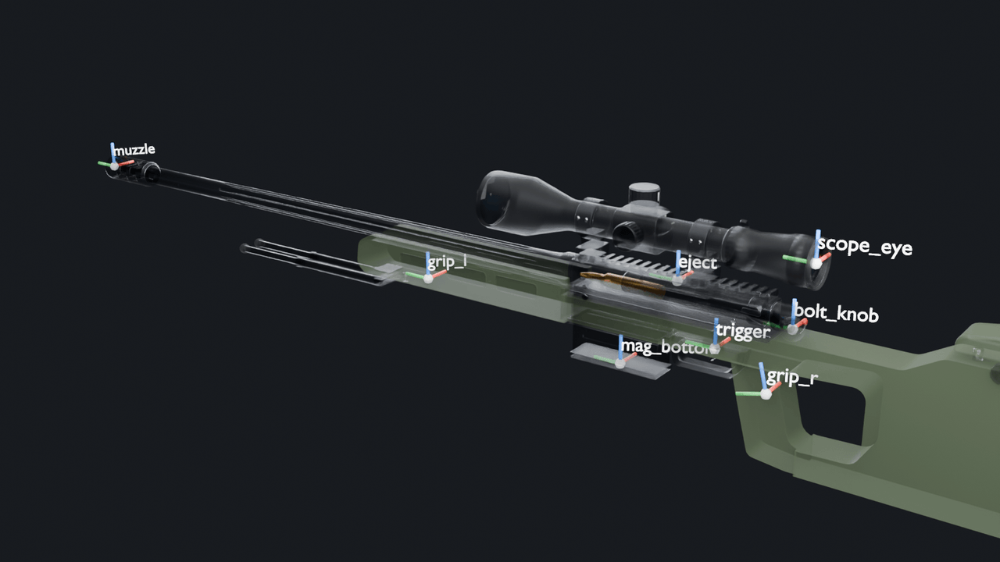
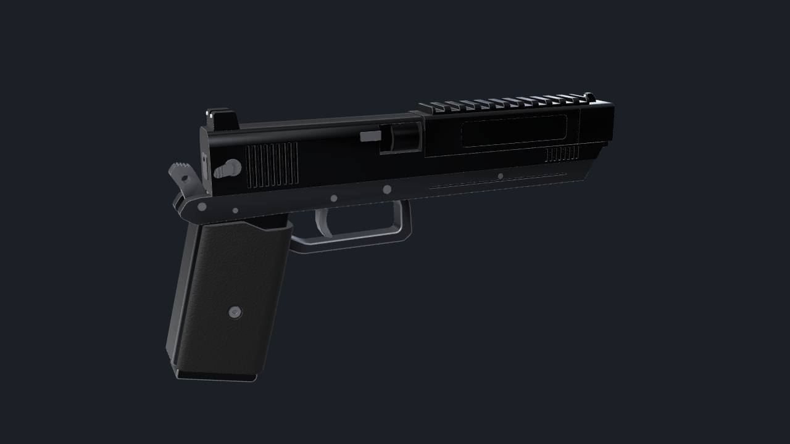
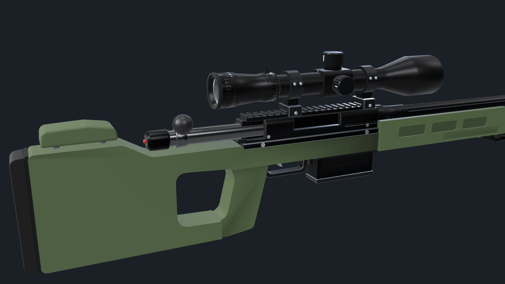
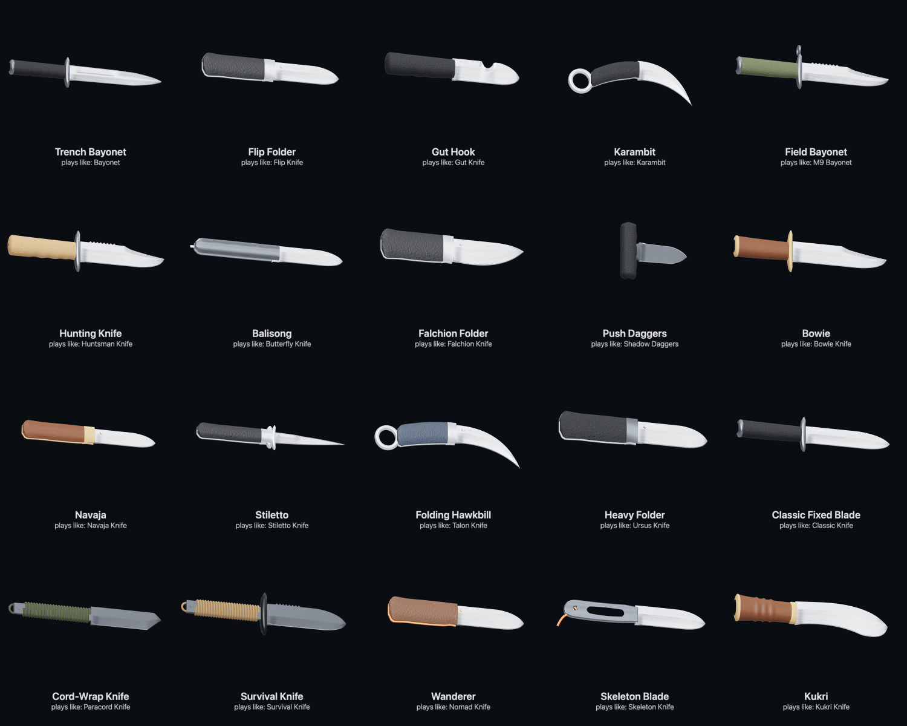
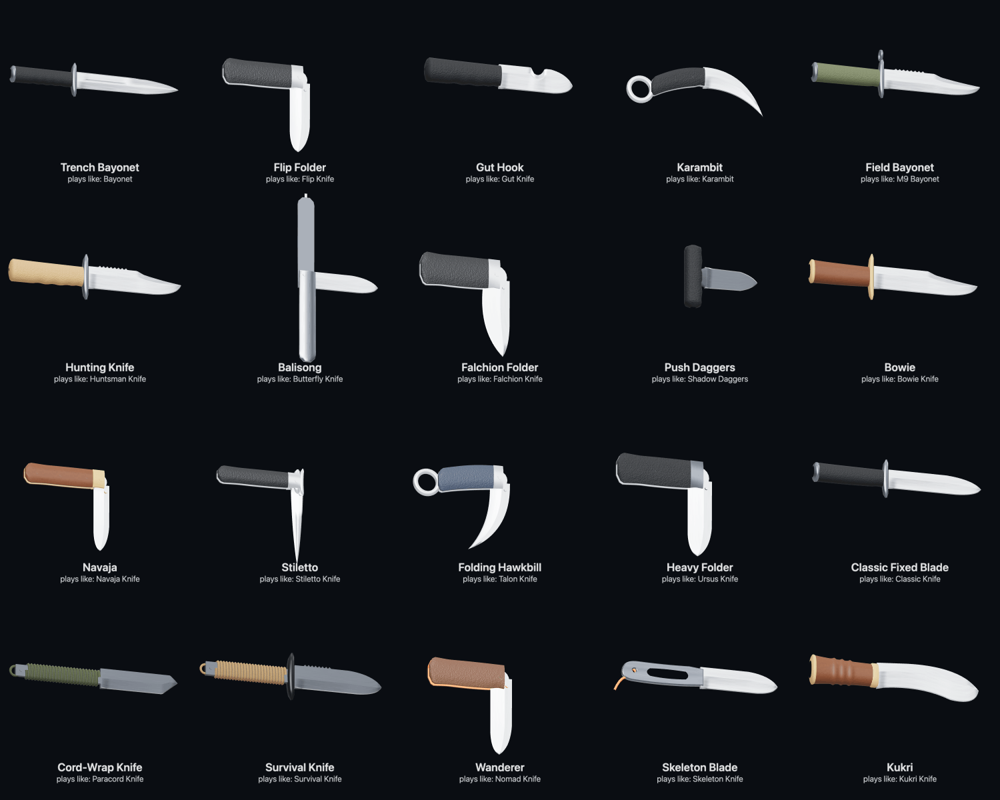

# Weapon and knife models (v2)

All of these models are original. The two firearms are built by committed
Blender scripts from 2D outlines, lathes and booleans. The 20 knives are built
in TypeScript at runtime. Nothing is imported: no Valve or Counter-Strike
assets, no Sketchfab rigs, no downloaded meshes or textures. The designs follow
real-world firearm and knife layouts (a heavy .50 gas pistol, a bolt-action
magnum with a thumbhole stock, common knife styles), the same way any shooter
models a real gun, but every vertex comes from code in this repo. The only
texture maps are small normal maps generated in the scripts.

Display names stay "AWP" and "Deagle".

## Rebuild

```bash
# firearms (blender 5.2 lts). --renders writes the preview pngs, omit it for a faster build
blender -b --factory-startup --python-exit-code 1 -P tools/blender/weapons/build_deagle.py -- --renders .blender-tmp/weapons/final
blender -b --factory-startup --python-exit-code 1 -P tools/blender/weapons/build_awp.py -- --renders .blender-tmp/weapons/final
npx tsx tools/assets/optimize-glb.ts .blender-tmp/weapons/deagle_raw.glb public/viewmodels/v2/deagle.glb --texture-size 1024
npx tsx tools/assets/optimize-glb.ts .blender-tmp/weapons/awp_raw.glb public/viewmodels/v2/awp.glb --texture-size 1024
node tools/blender/weapons/compress_previews.mjs .blender-tmp/weapons/final docs/screenshots/weapons 1280
npx vitest run tools/assets/weapons.test.ts

# quick iteration: no ao bake, orthographic left/right/top/front + 3/4 + first person in .blender-tmp/weapons/
blender -b --factory-startup --python-exit-code 1 -P tools/blender/weapons/build_deagle.py -- --quick
```

A full build takes about 30 to 40 s per weapon on the M5 (Cycles on Metal for
the renders, CPU for the vertex AO bake). The export is deterministic, so
rebuilding without script changes gives the same GLB.

## How the firearms are built

`tools/blender/weapons/wlib.py` holds the helpers, and each build script only
describes its gun.

- **Units and axes** follow `tools/blender/README.md`: metres, barrel along
  Blender +Y, top +Z. The scripts author in millimetres in a design frame
  (bore axis at z = 0), then shift everything so the **weapon origin is
  `socket_grip_r`**. Hands can attach with no extra offset.
- **Shapes** are side outlines (prisms across X), front sections (prisms along
  the barrel), lofts and lathes. Corners use real fillets in 2D. Exact
  booleans cut serrations, ports, rail slots, flutes, the magwell and screw
  recesses.
- **Edges** use an angle-limited bevel with hardened normals, so no box edge
  is left raw. On metal parts the convex bevel faces get `mat_steel_worn`:
  slightly brighter, lower roughness bare steel that reads as worn edges.
  Concave bevel faces go back to the base finish, because a real finish
  doesn't wear in inside corners.
- **Ambient occlusion** is baked with Cycles into a corner colour attribute
  `ao` and exported as `COLOR_0`. three.js multiplies it into the base
  colour. The static body is baked with every part in place. The magazine is
  baked on its own, so it doesn't look dirty when it drops out. Corner
  colours are averaged over corners that share a vertex and normal, so the
  AO doesn't split extra vertices (this cut the Deagle from 252 to 186 KB).
- **Textures**: `mat_grip` (Deagle) and `mat_polymer_green_stipple` (AWP grip
  and forend) carry a generated 256x256 pebble normal map on planar UVs. The
  optimizer turns it into WebP (about 30 KB). Everything else is plain PBR
  factors.
- **Moving parts are empties on the pivot with the mesh in a child named
  `<part>_mesh`.** `optimize-glb.ts` runs gltf-transform `meshopt()`. Inside
  it, `quantize()` folds a scale and offset into the matrix of every mesh
  node that has no children, which moves a leaf node's origin to its bounding
  box centre. A `trigger` or `hammer` mesh with its origin on the pin would
  then rotate about the wrong point. The named empty keeps the exact pivot,
  and only the unnamed quantization transform lands on `<part>_mesh`.
  `prune` in the optimizer keeps socket empties (`keepLeaves: true`). I
  checked every socket and pivot after optimization, and
  `tools/assets/weapons.test.ts` asserts it.
- **Animation hints** are stored as custom properties, which become glTF
  extras and then three.js `userData`. Directions and angles are in three.js
  axes.

### Materials

| material | used for |
|----------|----------|
| `mat_steel_dark` | black nitride: Deagle slide, barrel, rail, magazine; AWP receiver, barrel, brake, rail, bipod |
| `mat_gunmetal` | Deagle frame and guard (the second tone) |
| `mat_steel` | pins, screws, levers, hammer, trigger, polished AWP bolt |
| `mat_steel_worn` | convex bevel faces on metal parts |
| `mat_grip` | Deagle pebbled rubber wraparound grip |
| `mat_polymer_green`, `mat_polymer_green_stipple` | AWP stock, cheek rest, stippled grip and forend panels |
| `mat_aluminium` | AWP chassis rail, guard, magwell lip, rings, bipod mount, cheek wheel |
| `mat_scope` | scope tube, turrets, saddle |
| `mat_glass` | dark tinted domed lenses (opaque, so the tube never looks hollow) |
| `mat_rubber`, `mat_polymer_black` | butt pad, eye cup, bipod feet, bolt knob |
| `mat_sight_dot`, `mat_paint_white`, `mat_indicator`, `mat_brass` | sight dots, turret marks, cocking indicator, top round in each magazine |

## Deagle (`public/viewmodels/v2/deagle.glb`)

Heavy .50 gas pistol. It has a long slide with rear serrations (9) and front
serrations (8) on the slide arms under the barrel. The fixed barrel has a
Picatinny-style top rail and a heavy flat-sided front with a crowned bore.
The rear sight has anti-glare grooves and two white dots, and the front post
has one. It also has an exposed spur hammer with serrations, ambidextrous
safety levers on the slide, a slide stop, magazine release, barrel release
button, and pins. Other parts: a squared trigger guard, a pebbled
wraparound rubber grip with hex screws, a steel backstrap and beavertail,
and an ejection port on the right showing the chamber, with an extractor.
The magazine has a baseplate, witness holes and a .50 cartridge on top.

- Size: 285 mm long, 156 mm tall, 33 mm wide. The barrel is 152 mm from the
  breech face to the muzzle, and the grip angle is 14°.
- Triangles: 11,040 (body 6,048, slide 3,392, hammer 508, trigger 208, mag
  884). 10,201 vertices. The file is 186 KB optimized (573 KB raw).
- Nodes: `deagle` (root), then `body` (static mesh), `slide`, `hammer`,
  `trigger`, `mag` (pivot empties with `_mesh` children), and the sockets.

Socket and pivot positions, in three.js axes (+X right, +Y up, -Z forward,
metres), relative to `socket_grip_r`, which is the origin:

| node | parent | position | notes |
|------|--------|----------|-------|
| `socket_grip_r` | deagle | 0, 0, 0 | rotated -14° about X: local +Y runs up the grip (0, 0.970, -0.242) |
| `socket_grip_l` | deagle | -0.0163, -0.0010, -0.0080 | support palm on the left grip panel under the guard |
| `socket_trigger` | deagle | 0, 0.0279, -0.0554 | centre of the trigger face |
| `socket_muzzle` | deagle | 0, 0.0719, -0.2472 | bore exit, forward is -Z |
| `socket_eject` | deagle | 0.0130, 0.0729, -0.0982 | right side ejection port |
| `socket_mag_bottom` | mag | 0, -0.0576, 0.0149 | baseplate centre, in world terms (local to `mag`: 0, -0.0975, 0.0243) |
| `socket_slide_rear` | slide | 0, 0.0669, -0.0224 | middle of the rear serration band (serrations sit at x = ±0.013) |
| `slide` | deagle | 0, 0.0719, 0.0108 | on the bore axis at the slide's rear face |
| `hammer` | deagle | 0, 0.0449, 0.0163 | hammer pin |
| `trigger` | deagle | 0, 0.0419, -0.0572 | trigger pin |
| `mag` | deagle | 0, 0.0399, -0.0094 | top of the magazine on its axis |

Animation hints (`userData`):

- `slide`: `travel_m` 0.05. Move `position.z` by up to +0.05 (backwards).
- `hammer`: `fire_rot_x_deg` -55. The rest pose is cocked, and a negative
  `rotation.x` drops it forward. The slide should push it back past rest
  while it cycles.
- `trigger`: `pull_rot_x_deg` -14. A negative `rotation.x` swings the blade
  back.
- `mag`: `drop_dir` [0, -0.970, 0.242] and `drop_m` 0.16. The magazine drops
  along the grip rake.




## AWP (`public/viewmodels/v2/awp.glb`)

Bolt-action magnum, laid out like a thumbhole-stock precision rifle:

- **Stock:** green polymer stock with a stippled pistol grip, a cheek rest
  on two posts with an adjuster wheel, an aluminium spacer and a rubber butt
  pad. The forend is vented, with a stippled support-hand panel, and there
  are sling studs.
- **Chassis:** an aluminium rail under the receiver, plus the trigger guard,
  magwell lip and magazine release.
- **Action and barrel:** the steel receiver has an ejection port, a bolt
  release, a safety and screws. The fluted barrel (6 flutes) has a shank
  collar and a ported muzzle brake. The bolt has a polished body with flutes,
  a dark shroud with a red cocking indicator, and an angled handle with a
  round black knob. The detachable box magazine has ribs and a .338 round on
  top. A folded bipod sits under the forend.
- **Scope:** 350 mm long with a 50 mm objective (59 mm bell). It has a
  knurled diopter ring, a ribbed power ring with a throw lever and a rubber
  eye cup. The saddle carries elevation, windage and parallax turrets with
  knurled caps and white zero marks. Two rings on the rail have clamp nuts
  and cap screws. The lenses are domed tinted glass.

- Size: 1,185 mm long, 249 mm tall including the scope, 102 mm wide
  including the bolt knob. The barrel is 660 mm from the breech to the
  crown, and the brake adds 70 mm.
- Triangles: 25,188 (body 22,404, bolt 1,728, trigger 208, mag 848). 24,208
  vertices. The file is 365 KB optimized (1,214 KB raw).
- Nodes: `awp` (root), then `body`, `bolt`, `trigger`, `mag` (pivot empties
  with `_mesh` children), and the sockets.

| node | parent | position | notes |
|------|--------|----------|-------|
| `socket_grip_r` | awp | 0, 0, 0 | rotated -14° about X, local +Y up the pistol grip |
| `socket_grip_l` | awp | 0, 0.0310, -0.3939 | under the forend on the stippled panel, 34 cm ahead of the trigger face |
| `socket_trigger` | awp | 0, 0.0320, -0.0539 | trigger face |
| `socket_muzzle` | awp | 0, 0.0780, -0.8995 | brake exit |
| `socket_eject` | awp | 0.0160, 0.0840, -0.1045 | right side port |
| `socket_scope_eye` | awp | 0, 0.1340, 0.0371 | rear lens centre (scope axis 56 mm above the bore) |
| `socket_mag_bottom` | mag | 0, -0.0080, -0.1545 | baseplate centre (local to `mag`: 0, -0.076, 0) |
| `socket_bolt_knob` | bolt | 0.0540, 0.0460, -0.0015 | knob centre (local to `bolt`: 0.054, -0.032, 0.010) |
| `bolt` | awp | 0, 0.0780, -0.0115 | on the bore axis at the handle root |
| `trigger` | awp | 0, 0.0480, -0.0555 | trigger pin |
| `mag` | awp | 0, 0.0680, -0.1545 | top of the magazine |

Animation hints:

- `bolt`: `lift_rot_z_deg` 60 and `travel_m` 0.1. A positive `rotation.z`
  lifts the handle (that's a rotation about Blender's local Y, the bore).
  Then `position.z` goes up to +0.1 to pull the bolt back. The receiver cut
  lets the handle rise, and the stock wrist and eyepiece clear the full
  stroke.
- `trigger`: `pull_rot_x_deg` -12.
- `mag`: `drop_dir` [0, -1, 0] and `drop_m` 0.12. The magazine drops
  straight down.




### In three.js

`tools/weapon-preview.html` loads the optimized GLBs through
`createGltfLoader()` (meshopt), with the viewmodel lights, fov and room
environment. Params:

- `?weapon=deagle|awp&view=fp|side&sockets=1` picks the weapon and view and
  shows axes on every socket.
- Pose params from 0 to 1 apply the animation hints above: `slide`,
  `hammer`, `trigger`, `mag`, `lift` and `back` (the last two are the bolt).
- `center=x,y,z&dist=m` zooms the side view in on a part.




## Knives (runtime, `src/cosmetics/ProceduralKnife.ts`)

`src/combat/knives.ts` is still the catalog (ids, names, shape parameters,
timings, damage). Three optional fields were added: `mechanism` (`fixed`,
`folder` or `balisong`), `fingerRing` and `grind` (`flat`, `hollow` or
`sabre`). The public API is unchanged: `buildProceduralKnife`,
`disposeProceduralKnife` and `bladeShape`, plus the new `KNIFE_NODES` name
table and `isSharedKnifeTexture`. The frame is unchanged too: +X runs from
the guard to the tip, +Y is the spine, the edge faces -Y, Z is thickness,
units are metres, and the origin is where the hand meets the guard.

The code lives in `src/cosmetics/knife/`:

- `profiles.ts`: each blade profile is an edge curve and a spine curve that
  meet at the tip. Each profile also records where a clip swedge, a second
  edge or the gut hook sits.
- `blade.ts` builds the real cross section. Stations run along both curves,
  and each station spans edge to spine. The section is split into facet
  bands, and each band has its own vertices, so the creases stay crisp.
  From the edge up:
  - the sharp edge with a 1.1 mm polished secondary bevel (its own material,
    it reads as a bright line)
  - a flat or hollow primary grind, with a visible grind line and a curved
    plunge at the ricasso
  - the flats at full thickness, with distal taper toward the tip, closing
    to a point in every direction
  - an optional fuller cut as a real rounded groove, a swedge on clip
    points, a second edge on daggers and push daggers, and a sharpened gut
    hook
  - sawback teeth as separate raked, flat-shaded teeth on the spine
- `parts.ts` has the handle and fitting builders:
  - lofted handles with a superellipse section, finger grooves, a choil,
    swell and flare, kukri rings and pommel caps
  - domed scales on liners, with pins and a flat inner face
  - a helical paracord wrap (a tube along a tight helix around the tang)
    with a lanyard loop
  - crossguards with swept quillons, the muzzle ring, finger rings
  - the skeleton frame, extruded with two cut-outs and bevelled
  - the push dagger tee bar with finger grooves
- `materials.ts`: every knife gets its own `MeshStandardMaterial` set:
  - satin steel with a brushed roughness and colour map; blades the catalog
    colours dark get a matte coated finish and still show a bright
    sharpened edge
  - rubber with the pebble normal map, G10 scales with a finer grain, wood
    with a grain map, paracord with a braid colour and normal map
  - metal handles, and accents (steel, brass, black coated, or orange G10)
- `textures.ts`: six tiny `DataTexture`s (at most 256x256) are generated
  once and shared by every knife. They are never disposed per knife, so
  disposing one knife can't break another. Materials and geometries are
  per knife and get disposed.

Articulation and sockets (all names are in `KNIFE_NODES`):

| knives | groups | sockets |
|--------|--------|---------|
| all | none | `socket_grip` (centre of a hammer-grip hand on the handle), `socket_tip` |
| flip, talon, navaja, falchion, nomad, ursus, stiletto | `blade_pivot` at the pivot pin; the blade, tang disk, thumb stud and `socket_tip` sit under it | `socket_pivot` |
| butterfly | `handle_safe` and `handle_bite`, each on its own tang pin (spine side and edge side) | `socket_pivot_safe`, `socket_pivot_bite` |
| karambit, talon | `finger_ring` | `socket_ring` (child of `finger_ring`, at its centre) |
| push daggers | none; `userData.pair = true`, build two for dual wield | |

- Folders: `blade_pivot.rotation.z` goes from 0 (open) to -π (closed). The
  folder handles are 1.12 times the blade height, and the pin is placed so
  the closed edge sits under the backspacer.
- Balisong: `handle_safe.rotation.z` goes from 0 to +π (swings over the
  spine) and `handle_bite.rotation.z` from 0 to -π (swings under the edge).
  The latch rides on the bite handle.

Triangles per knife (budget 8,000): bayonet 3,876, flip 3,512, gut 2,488,
karambit 4,216, M9-style 3,592, huntsman 3,056, balisong 2,172, falchion
3,308, push daggers 2,252, bowie 2,840, navaja 3,100, stiletto 4,044, talon
4,440, ursus 3,100, classic 3,044, paracord 3,662, survival 4,182, nomad
2,940, skeleton 2,840, kukri 2,736. Most knives build in 1 to 5 ms in Node.
The first knife that needs a given texture also generates it, which costs up
to about 25 ms once.

Dev tools:

- `tools/knife-gallery.html` renders every knife with the same room
  environment and ACES tone mapping as the viewmodel scene. Open it through
  the dev server; `?fold=0.5` swings the folders and the balisong.
- `tools/blender/weapons/dump_knives.ts` plus `render_knives.py` render the
  same geometry in Blender for close-ups.




## Tests

- `tools/assets/weapons.test.ts` reads the optimized GLBs with the meshopt
  decoder. It checks:
  - every contract node exists once, and the moving sockets have the right
    parents
  - the pivots are clean (no mesh, identity rotation, unit scale, geometry
    in a child)
  - the size is within 10% of the target
  - the barrel points along -Z from the grip, and `socket_grip_r` tilts up
    the rake and sits at the origin
  - the triangle budgets hold, and AO and `mat_*` materials are on every
    primitive
  - the support hand and scope eye are placed correctly
- `src/cosmetics/__tests__/ProceduralKnife.test.ts` checks:
  - sockets on all 20 knives
  - folders folding about a fixed pin, with the closed edge under the
    backspacer
  - both balisong halves swinging about their own pins
  - finger rings a finger fits through, and the push dagger pair
  - finite, closed, outward-wound meshes under 8k triangles
  - sharp edges with a polished bevel, sawback teeth and the fuller groove
  - disposal that leaves the shared textures alive
- `src/combat/__tests__/knives.test.ts` also checks the mechanism,
  finger-ring and pair flags in the catalog.
