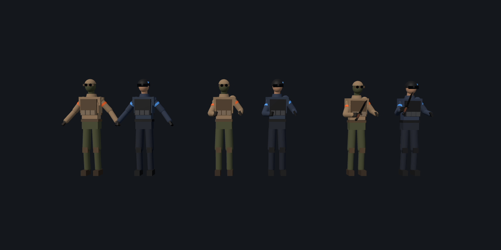

# WebStrafe revamp plan

Status: phase 1 in review (branch `revamp/netcode-phase1`) · Last updated: 2026-09-26

Goal: make WebStrafe play like a CS2/CS:GO bhop and surf server. That means
Source-accurate bhop and air strafing, surf that keeps working, proper netcode,
a sniper, a heavy pistol and a full knife roster. All of it runs in the browser.

## 1. Why multiplayer felt buggy and laggy

Everything below was measured, not guessed. The numbers come from
`tools/netbench/` (see section 8). The bench runs two bot players circling at
16 m/s (a fast bhop pace) and one shooter that renders them with the real
`RemotePlayersRenderer` and fires at exactly where it sees them. With perfect
aim, the correct hit rate is 100%.

### What is actually live

- `strafe.yassin.app` is a static Vercel build. Its bundle has a Supabase
  project URL baked in and loads `SupabaseMultiplayer`. Production
  multiplayer is **Supabase Realtime broadcast**, and one player's browser tab
  is elected host. That tab runs the bots and resolves every shot.
- The Node WebSocket server (`server/index.ts`, `Dockerfile`, `fly.toml`) exists
  in the repo but was never deployed as far as anything public shows.
  `fly.toml` still has the placeholder app name and `iad`, and no
  `*.fly.dev` host for it resolves. History: PR #18 scaffolded Vercel + Fly,
  and PR #19, merged the same day, switched production to Supabase.
- The deployed commit (`f372f70`) is an empty commit on top of `910bb4a`,
  so live code equals `main`.

### Failure modes, ranked by impact

| # | Failure | Evidence |
|---|---------|----------|
| 1 | **Lag compensation used the wrong clock in Supabase mode.** The shooter sent its own `Date.now()` as "server time", but the host compared it against the host's clock. Any skew above a few ms, or a future timestamp, silently disabled rewind. | Supabase bench, shooter clock 150 ms off (normal for home PCs): **0 of 29** perfect-aim shots hit. With zero skew: **6 of 34 (17.6%)**. |
| 2 | **Remote players had no timeline.** Rows carried no sample time. The client chased the newest position with exponential smoothing (rate 14/s). Fast players were drawn about 2 m behind, stuttered whenever packets bunched, and the server's 71 ms rewind guess didn't match what was on screen. | WebSocket bench on a perfect LAN link: drawn 2.06 m behind at p50, stutter (p95 per-frame speed error) 0.45, hit rate 63%. At 60 ms RTT: 45%. At 150 ms RTT with jitter and loss: **6.5%**. |
| 3 | **Three free-running 20 Hz timers stacked up.** The game sent states on a reset-to-zero accumulator (actually 18.3 Hz at 128 Hz ticks). The transport resampled on its own `setInterval`, and receivers rebuilt snapshots on a third timer. That created duplicated and skipped samples plus up to about 100 ms of aliasing delay. | Unit test pins the 18.3 Hz. Supabase bench p95 stutter was 0.80 and 2.5% of frames froze. |
| 4 | **The host tab runs the match.** Browsers throttle timers in hidden tabs. With the old 100 ms dt clamp, bots moved at 1/10 speed and bot and combat broadcasts dropped to about 1 Hz for everyone while the host was alt-tabbed. | Headless Chromium: the host loop runs 58.8 Hz in the foreground and **1.2 Hz** hidden, with 992 ms median gaps (`tools/netbench/tab-throttle.mjs`). |
| 5 | **Supabase traffic ignored the per-project event budget.** One idle, paused player's tab broadcast `botstate` at 58.6 Hz (283 B) plus `state` at 20 Hz (253 B), about 79 msgs/s. Supabase bills sent plus delivered per receiver, and the free plan caps at 100 events/s. Two players come to about 200/s. | Live capture of the production lobby. A 15 s replay at about 280 events/s did **not** trip `tenant_events` on this project, so this is a documented risk and cost driver, not the observed failure. It becomes the limit as rooms grow, because traffic is O(N²). |
| 6 | **Presence calls were used for per-toggle state.** `setCombatReady` called `track()` on every pause and unpause. Supabase allows 5 presence calls per client per 30 s. | Documented limit. It's a source of "bots ignore me or won't stop" reports after rapid pausing. |
| 7 | **The anti-teleport origin check rejected fast shooters.** Fire origins more than 3 m from the shooter's last sample were dropped. At surf speeds and low update rates, a legit origin is that far ahead. | Unit test: a shooter at 30 m/s with a 200 ms-old sample is rejected before the fix and accepted after. |
| 8 | **Relay latency.** Supabase relays every message through its region. | Calgary to Supabase to Calgary, one-way p50 48 ms and p99 65 ms, even with both players in the same city. |

Things that were fine: the `ws` server disables Nagle (`setNoDelay`) and has
`perMessageDeflate` off by default. JSON snapshots are about 650 B for three
players. The Node server loop timing was steady (snapshot spacing p99 within
3 ms of nominal). There is no local-player rubber-banding today because each
client is authoritative over its own movement. That is also why movement
isn't cheat-proof (see phase 2).

## 2. What phase 1 changed (this PR)

- `src/netcode/`: a `SourceClock` (min-offset clock mapping, so no clock sync
  is needed), an `InterpolationBuffer` (Hermite with sent velocities, a 250 ms
  bounded extrapolation, teleport snap), a `RemoteTimeline` (slewed render
  delay, never runs backwards), `SendCadence` (tick-driven, keeps phase),
  `RateBudget`, and `PredictionLedger` + `ErrorSmoother`.
- Every state and snapshot row carries its sample time and clock. Fires carry
  the exact time each target was rendered at, in that target's own clock.
  `CombatArena` rewinds each target with the same Hermite math (400 ms cap)
  and projects fast shooters before the origin check.
- WebSocket server: dejittered client samples, drift-free 30 Hz snapshots and
  bot loop, backed-up sockets skipped instead of queued, quantized rows.
- Supabase protocol `p2`: one merged state message per client (bots ride on
  the host's), a room-size send-rate budget, 1 Hz keepalive while paused,
  batched combat events, readiness and host eligibility carried in state
  instead of presence, hidden tabs handing off hosting, and a fixed 60 Hz host
  step. The channel name carries the protocol version, so old and new clients
  never mix.
- Knives: a data model for all 20 CS2 knife types, procedural original models,
  a first-person swap onto the existing animated arms, and a Knives tab in the
  menu (section 5).

### Before and after (perfect aim, 16 m/s targets)

WebSocket server through the delay proxy (`npm run bench:net`), 30 s per profile:

| Link | Hit rate before → after | Drawn behind, p50 (m) | Stutter p95 | Frozen frames |
|------|------------------------|--------------------|-------------|---------------|
| LAN | 63% → **100%** | 2.06 → 1.36 | 0.45 → 0.11 | 0% → 0% |
| 60 ms RTT | 45% → **100%** | 2.96 → 2.23 | 0.45 → 0.10 | 0% → 0% |
| 60 ms RTT, ±15 ms jitter, 2% loss | 50% → **100%** | 3.08 → 2.92 | 0.99 → 0.14 | 4.5% → 0% |
| 150 ms RTT, ±20 ms jitter, 1% loss | 6.5% → **87.5%** | 4.43 → 4.30 | 0.98 → 0.13 | 4.8% → 0.7% |

Supabase, real project from Calgary, three clients (mover host + mover + shooter):

| Case | Hit rate before → after | Stutter p95 | Frozen frames |
|------|------------------------|-------------|---------------|
| Shooter clock 150 ms off | 0% → **100%** | 0.80 → 0.06 | 2.5% → 0% |
| Clocks in sync (before only) | 17.6% | 0.54 | 0.6% |

"Drawn behind" is intentional interpolation delay plus network latency. CS
does the same thing (cl_interp) and hides it with lag compensation, which is
why the hit rate is the number that matters. Bandwidth per WebSocket client
rose from 14.7 to 21 KB/s because snapshots went from 20 to 30 Hz.

## 3. Netcode target (phase 2)

The end state is a **server-authoritative dedicated server**, which is what the
resume describes. Supabase stays as a free fallback for casual rooms.

1. **Tick-stamped inputs.** Clients send `{tick, buttons, wishMove, yaw,
   pitch}` at 64 or 128 Hz, batched about 4 per packet with the last 2 batches
   repeated for loss tolerance. The server buffers 1 to 2 ticks of input per
   player (adaptive, like CS's input buffer) and simulates `MovementController`
   for every player on the same fixed tick.
2. **Prediction and reconciliation.** Already built and tested
   (`PredictionLedger`, `captureState`/`restoreState`). Identical inputs replay
   bit-exactly, and server-only effects (knockback, teleports) are corrected
   with one rollback and replay. Wiring: snapshots carry `ackTick` + the
   player's authoritative state, the client reconciles, and `ErrorSmoother`
   hides the snap. The bench already measures correction magnitudes once this
   is on.
3. **Snapshot interpolation** for remotes. Done in phase 1. Next steps are
   delta-compressed snapshots against the last acked baseline and a binary
   encoding (about 20 B per player instead of about 200).
4. **Lag compensation.** Done in phase 1 per target. Move from capsules to
   per-hitbox rewind (head, chest, stomach, limbs) once player models have
   hitboxes.
5. **Transport.** Stay on WebSocket for now, where TCP head-of-line stalls are
   what cause the remaining 150 ms-RTT misses. Add WebTransport datagrams
   (unreliable, unordered) for snapshots and inputs where supported, with the
   WebSocket as fallback.
6. **Hosting.** Fly.io `sea` (Seattle), not `iad`. Measured from Calgary: 30 ms
   RTT to AWS us-west-2 versus 61 ms to us-east-1. One shared-cpu-1x machine
   handles a few rooms. Add a second region if players aren't in western
   North America.
7. **Anti-cheat basics.** Server movement authority removes speed and teleport
   hacks. Keep the fire-rate and origin checks, and rate-limit inputs.

## 4. Movement: Source-accurate bhop and surf (phase 2)

Current state: a 128 Hz fixed-step kinematic controller with ground, air and
surf modes, ramp clipping, BVH collision and a movement test suite (all
passing). One known gap stands out:

- **No 30 u/s air wishspeed cap.** Source's `AirAccelerate` clamps the
  wishspeed used for `addspeed` to 30 u/s (0.76 m/s in our metre units) while
  `accelspeed` still uses the full wishspeed. That cap is what makes speed gain
  depend on turning in sync with your strafe. `accelerate()` here uses the full
  9.5 m/s in the air, so air control is too strong. `sv_airaccelerate` was
  lowered to 24 to compensate.
- Plan: add `sv_air_max_wishspeed` (default 0.76 m/s), move to CS bhop-server
  values (`sv_airaccelerate` 150 for bhop, 100 for surf, both configurable),
  and retune the surf tests against recorded reference runs.
- **Autobhop:** always on by default on every map, including combat (decided
  2026-09-27). It's `sv_autobhop_enabled: true` plus the settings default, and
  players can still turn it off in Settings. When movement becomes
  server-authoritative, the server copies the same default.
- Keep ramp clip and edge-slide behaviour. Add a strafe sync percentage and a
  gain HUD (the `recommendedStrafe` debug field is already a start).

## 5. Weapons and knives

Display names stay **"AWP"** and **"Deagle"** (decided 2026-09-27). For the
record, "AWP" is an Accuracy International trademark and "Desert Eagle" is a
Magnum Research trademark. "Counter-Strike"/"CS2" are Valve's and aren't used
in game.

### Sniper (AWP-style), phase 2

- Two scope zoom levels (FOV 40° and 10°), scope overlay, unscope on fire and
  re-scope after the bolt.
- One-shot kill to the body (115 damage, head 1.5×), limb damage lower once
  hitboxes exist.
- Inaccuracy model: standing ≈ 0, crouch lower, moving or in the air large. No
  scoped accuracy while moving over 34% of max speed, so jump shots are
  deliberately bad, like CS.
- Bolt cycle 1.46 s, which is the current `FIREARM_TIMINGS`. Reload is a
  separate animation.

### Heavy pistol (Deagle-style), phase 2

- First-shot accuracy when standing still, recovering over about 0.4 s. Recoil
  with a vertical kick and a random horizontal drift, and a view punch that
  decays.
- 63 body damage, 2× headshot (126, a one-tap).
- Fire interval 225 ms (current), 7-round magazine.

### Knives (phase 1 foundation, done here)

The verified CS2 knife list (Sep 2026) is 20 types. The Kukri (Kilowatt Case,
Feb 2024) is the newest. Sources:
[CSDB knife list, cross-checked with game files](https://csdb.gg/cs2-csgo-knife-tier-list/)
and [Tradeit case history](https://tradeit.gg/blog/all-knife-cases-in-cs2/).

| CS2 type | In-game name | Profile / handle |
|----------|--------------|------------------|
| Bayonet | Trench Bayonet | spear, fuller, cross guard, grip |
| Flip Knife | Flip Folder | drop point, bolster, scales |
| Gut Knife | Gut Hook | gut hook, grip |
| Karambit | Karambit | hawkbill, finger ring |
| M9 Bayonet | Field Bayonet | clip point, serrated spine, muzzle ring |
| Huntsman Knife | Hunting Knife | clip point, serrated spine |
| Butterfly Knife | Balisong | split handles, latch, pivot |
| Falchion Knife | Falchion Folder | cleaver belly |
| Shadow Daggers | Push Daggers | T-handle (dual) |
| Bowie Knife | Bowie | large clip point, wood |
| Navaja Knife | Navaja | slim drop point, wood |
| Stiletto Knife | Stiletto | needle |
| Talon Knife | Folding Hawkbill | hawkbill, scales |
| Ursus Knife | Heavy Folder | wide drop point |
| Classic Knife | Classic Fixed Blade | drop point, cross guard |
| Paracord Knife | Cord-Wrap Knife | tanto, cord wrap |
| Survival Knife | Survival Knife | serrated, cord wrap |
| Nomad Knife | Wanderer | drop point, scales |
| Skeleton Knife | Skeleton Blade | open frame handle |
| Kukri Knife | Kukri | recurve, wood |


Implementation:

- `src/combat/knives.ts` is the catalog: shape parameters, draw and inspect
  timings, and the shared CS-style damage (primary 40, or 25 on a follow-up;
  secondary 65; backstab 90 and 180). `isBackstab()` uses the same rear cone as
  the existing "backstab ready" cue.
- `src/cosmetics/ProceduralKnife.ts` builds every model from code: extruded 2D
  blade profiles, guards, handles, rings, serrations and cord wraps, all under
  6k triangles. No external assets.
- `src/cosmetics/KnifeStyleSwap.ts` measures the authored knife inside the
  arms viewmodel, hides it, and mounts the procedural knife on the same
  animated `knife` node. That way every existing draw, idle, attack and inspect
  animation keeps working.
- The menu's **Knives** tab lists all 20 plus "Legacy Knife". The choice is
  saved in localStorage, and the default is the Karambit.

| Procedural karambit | Legacy imported knife |
|---|---|
|  |  |

Next for knives (phase 2): per-type animation sets (butterfly flip draw, karambit
spin inspect, push daggers dual wield) built as original procedural keyframes;
server-side primary and secondary resolution using `knifeDamage` + `isBackstab`
(the server already has victim yaw); knife id in presence and join so remote
players show your knife; finishes (the existing `WearMaterial` shader).

## 6. Viewmodels, feedback, maps, UI, audio

- **Viewmodels:** keep the current rig for now. Build original arms (procedural
  or Blender, which isn't installed on this machine) to replace the imported
  ones (see section 7). Add sway, bob and landing dip per weapon (partly there
  in `ViewmodelRenderer`).
- **Hit feedback:** server-confirmed hitmarkers and damage numbers exist.
  Add a headshot ding, kill confirm, directional damage indicator, and blood or
  impact decals from the server-resolved endpoint.
- **Maps:** keep `surf_skyworld_x` (CC-BY) and the training maps. Add original
  bhop maps (block-out style, easy to author procedurally) and a small aim arena
  for AWP and Deagle duels.
- **UI:** loadout screen (primary, secondary, knife, gloves), a scoreboard on
  Tab (kills, deaths, ping, speed record), the existing killfeed, a net graph
  (ping, loss, interp delay; `getPresentationDelayMs` is exposed), and a speed
  and sync HUD for bhop.
- **Audio:** keep CC0 Freesound and BigSoundBank sources, add procedural Web
  Audio for knife hits and footsteps, and make gunshots positional.

## 7. IP and licensing

Rules for new work: no Valve or Counter-Strike assets (models, textures,
sounds, animations, maps) and nothing without a clear licence. Everything
added in phase 1 is original code-generated geometry.

Existing assets that need a licence review (not changed in this PR):

- ~~`public/playermodels/*.glb`, the Sketchfab "CS2 Agent Model" uploads~~.
  **Replaced** with original code-generated models
  (`src/multiplayer/ProceduralPlayer.ts`) and the GLBs were deleted. The new
  skeleton reuses only the bone naming and joint-axis convention (25 joint
  orientations) so the existing stance and swing poses keep working. Mesh,
  proportions and materials are our own.

  
- `public/viewmodels/knife/*.glb` ("knife animated" by DJMaesen) and the
  Deagle and AWP rigs (1Matzh, Addison Ye) are Sketchfab CC-BY. Their
  provenance is unverified; they may be game rips. The procedural knives
  already remove the knife blade from the visible default.
- `surf_skyworld_x` (EVAI, CC-BY): confirm EVAI is the original map author and
  not a re-upload of a community CS map.

## 8. Reproducing the measurements

```bash
npm run bench:net                                    # ws server, 4 link profiles, 25 s each
npm run bench:net -- --only rtt60_jitter_loss --secs 30
VITE_SUPABASE_URL=... VITE_SUPABASE_KEY=... npm run bench:net -- --transport supabase --skew 150
VITE_SUPABASE_URL=... VITE_SUPABASE_KEY=... npx tsx tools/netbench/supabase-probe.ts prod
CHROME_PATH=/path/to/chrome node tools/netbench/tab-throttle.mjs
```

Results land in `tools/netbench/results/`. Baseline (`before-*`) files were
produced from `main` with the same bench code. The Supabase modes only ever use
`webstrafe_bench_*` channels, never a real lobby, but they do count towards the
project's message quota.

## 9. Phases

1. **This PR:** root-cause netcode fixes, bench, prediction foundation, knife
   data model and all 20 procedural knives with a selector.
2. **Authoritative server:** inputs, server movement, reconciliation wired
   end-to-end, Fly.io `sea` deploy (needs approval), air wishspeed cap + bhop
   cvars, net graph.
3. **Weapons:** sniper scope, inaccuracy, bolt; pistol recoil and accuracy;
   server-side knife primary, secondary and backstab; hitboxes.
4. **Content:** original arms and player models to replace the flagged assets,
   per-knife animations, bhop maps, scoreboard, loadout screen, audio pass.
